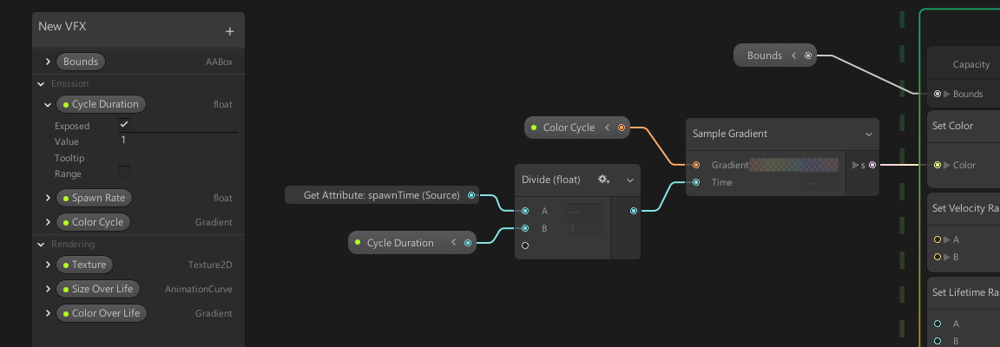
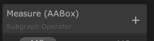
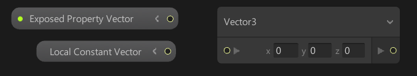
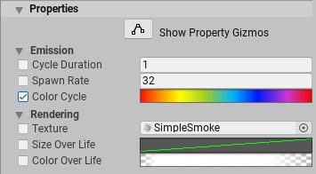

# Blackboard 面板

Blackboard 是 [Visual Effect Graph 窗口](VisualEffectGraphWindow.md)中的一个实用工具面板，可用于管理属性。在这里，您可以定义、排序和分类属性。您还可以公开属性，以便可以从图形外部访问它们。

您在 Blackboard 中定义的属性是全局变量，您可以在整个图表中多次使用。例如，您可以定义一次边界框属性，然后将其用于图表中的多个粒子系统。

Blackboard 中的属性可以是**常量**，也可以是**公开的**。如果您公开某个属性，则可以在 [Visual Effect 组件](VisualEffectComponent.md) 上以及通过 C# API 查看和编辑该属性。

为了区分公开的属性和常量，Blackboard 会在公开的属性标签左侧显示一个绿点。

## 使用 Blackboard

要打开 Blackboard，请单击 Visual Effect Graph 窗口[工具栏](VisualEffectGraphWindow.md#Toolbar)中的 **Blackboard** 按钮。要调整 Blackboard 的大小，请单击任何边缘或角落并拖动。要重新定位 Blackboard，请单击标题并拖动。

### Menu Category 菜单类别

为了设置当前编辑的子图的菜单路径，您可以双击Blackboard的副标题并输入所需的类别名称，然后使用 Return 键进行验证。

### 创建属性

要创建属性，请单击 Blackboard 右上角的加号 （**+**） 按钮，然后从菜单中选择属性类型。

您还可以将内联 Operator 转换为属性。为此，请右键单击 Node 并选择以下任一选项：

- **Convert to Property**，如果您想创建一个常量。
- **Convert to Exposed Property**，如果您要创建公开的属性。

无论您选择哪个选项，您都可以稍后启用或禁用 **Exposed** 设置。

### 编辑属性

要在 Blackboard 中编辑属性，请单击该属性左侧的折叠箭头。这将公开可用于编辑属性的设置。不同的属性公开不同的设置。核心设置包括：

| **设置** | **描述**                                              |
| ----------- | ------------------------------------------------------------ |
| **Exposed** | 指定是否公开属性。启用后，您可以在 [Visual Effect 组件](VisualEffectComponent.md)以及通过 C# API 进行。 |
| **Value**   | 指定属性的默认值。如果您不公开该属性，或者公开该属性但不覆盖它，则 Visual Effect Graph 会使用此值。 |
| **Tooltip** | 指定将鼠标悬停在 Visual Effect 的 Inspector 中的属性上时显示的文本。 |

### 筛选属性

Float、Int 和 Uint 属性有一些过滤模式：

* default。 没什么特别的。您将在文本字段中编辑属性值。
* Range。 您将在Blackboard中指定最小值和最大值，并且您将使用滑块（而不仅仅是文本字段）编辑属性。
* Enum。 独有于 uint，您将在Blackboard中指定一个名称列表，并使用弹出菜单编辑属性。

### 排列属性

- 要**重命名**属性：
  1. 双击属性名称或右键单击属性名称，然后从上下文菜单中选择 **Rename**。
  2. 在可编辑字段中，键入新名称。
  3. 最后，要验证更改，请按 **Enter** 键或单击字段以外的位置。
- 要对属性**重新排序**，请将它们**拖放**到 Blackboard 中。
- 要**删除**属性，请执行以下任一操作：
  - 右键单击该属性，然后从上下文菜单中选择 **Delete。**
  - 选择属性，然后按 **Delete** 键（对于 macOS，为 **Cmd** + **Delete** 键）。

### 属性类别

类别允许您将属性分类到组中，以便更轻松地管理它们。您可以像重命名属性一样**重命名**、**重新排序**和**删除**类别。

- 要**创建**类别，请单击 Blackboard 右上角的加号 （**+**） 按钮，然后从菜单中选择**类别**。
- 您可以将属性从一个类别**拖放**到另一个类别，或者如果您希望某个属性不属于任何类别，则可以将其拖放到窗口顶部。

## 属性节点

属性节点看起来与标准节点略有不同。它们会显示属性名称，如果属性已公开，则会显示一个绿点。

您可以展开它们以使用属性值的子成员。

## Inspector 中公开的属性

当您为属性启用 **Exposed** 设置时，该属性将在[Visual Effect](VisualEffectComponent.md) 的 Inspector 的 **Properties** 部分中可见。属性的显示顺序和类别与您在 Blackboard 中设置的顺序和类别相同。

### 覆盖属性值

要编辑属性值，您需要覆盖它。为此，请启用属性名称左侧的复选框。启用此复选框时，Visual Effect Graph 将使用您在 Inspector 中指定的值。如果禁用此复选框，则 Visual Effect Graph 将使用您在 Blackboard 中设置的默认值。

### 使用 Gizmo

您可以使用 Gizmo 编辑某些高级属性类型。要启用 Gizmo 编辑，请单击 **Show Property Gizmos** 按钮。要使用 Gizmo 编辑兼容的属性，请单击该属性旁边的 **Edit** 按钮。
