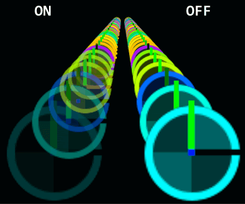

# Camera Fade

菜单路径：**Output > Camera Fade**

**Camera Fade** 代码块淡出过于接近摄像机近平面的粒子。它计算提供的 **Faded Distance** 和 **Visible Distance** 属性之间的当前深度插值，以确定要应用的淡入淡出量。为了淡入淡出粒子，此代码块将修改粒子的颜色和/或 alpha 属性。

如果您输入的 **Faded Distance** 大于 **Visible Distance**，结果是粒子在靠近摄像机时淡入，而不是在靠近时淡出。

## 代码块兼容性

此代码块兼容于以下上下文：

+   任何输出上下文

## 代码块设置

| **设置** | **类型** | **描述** |
| --- | --- | --- |
| **Cull When Faded** | Bool | **（检查器）** 指示是否剔除完全淡出的粒子以减少过度绘制。 |
| **Fade Mode** | Enum | 指定当粒子靠近摄像机时如何淡出粒子。选项：  
• **Color**：淡出粒子的颜色。  
• **Alpha**：淡出粒子的 alpha。  
• **Color And Alpha**：淡出粒子的颜色和 alpha。 |

## 代码块属性

| **Input** | **类型** | **描述** |
| --- | --- | --- |
| **Faded Distance** | float | 距摄像机多远时完全淡出粒子。 |
| **Visible Distance** | float | 距摄像机多远时开始淡出粒子。粒子在此距离时完全可见。在此距离与 **Faded Distance** 之间，粒子淡出消失。 |
