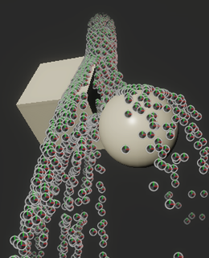

# Collide with Depth Buffer

菜单路径：**Collision > Collide with Depth Buffer**

**Collide with Depth Buffer** 代码块使粒子与特定摄像机的深度缓冲区发生碰撞。这对于快速移动的粒子（如火花或雨滴）特别有用，因为不需要特别精确的碰撞。

**重要提示：**要使代码块生成深度碰撞，必须启用指定的摄像机并且游戏视图必须可见。

## 代码块兼容性

此代码块兼容于以下上下文：

+   [Update](Context-Update.md)

## 代码块设置

| **设置** | **类型** | **描述** |
| --- | --- | --- |
| **Camera** | Enum | 决定使用哪个摄像机来计算深度碰撞的方法。选项有：   • **Main**：使用场景中的主摄像机。这要求场景中的摄像机拥有 **MainCamera** 标签。   • **Custom**：允许您指定要使用的特定摄像机。 |
| **Surface Thickness** | Enum | 决定如何指定碰撞表面厚度的方法。选项：    **Infinite**：将碰撞表面的厚度设置为无限。   • **Custom**：允许您指定特定的厚度值。 |
| **Radius Mode** | Enum | 决定每个粒子碰撞半径的模式。选项：   • **None**：粒子的半径为零。   • **From Size**：粒子从它们各自的大小继承半径。   • **Custom**：允许您将粒子的半径设置为特定值。 |
| **Rough Surface** | Bool | 切换碰撞体是否模拟粗糙表面。启用后，Unity 会向粒子反弹的方向添加随机性，以模拟与粗糙表面的碰撞。 |

## 代码块属性

| **Input** | **类型** | **描述** |
| --- | --- | --- |
| **Bounce** | Float | 碰撞后应用于粒子的反弹量。值为 0 表示粒子不会反弹。值为 1 表示粒子以与它们撞击的相同速度弹开。 |
| **Friction** | Float | 粒子在碰撞过程中损失的速度。最小值为 0。 |
| **Lifetime Loss** | Float | 粒子在碰撞后失去的生命比例。 |
| **Roughness** | Float | 粒子与表面碰撞后随机调整方向的量。   此属性仅在启用 **Rough Surface** 时显示。 |
| **Radius** | Float | 此代码块用于碰撞检测的粒子半径。  
此属性仅在将 **Radius Mode** 设置为 **Custom** 时显示。 |
| **Camera** | Camera | 用于生成碰撞表面的摄像机。此代码块使用来自此摄像机的深度缓冲区来生成碰撞表面。   此属性仅在将 **Camera** 设置为 **Custom** 时显示。 |
| **Surface Thickness** | Float | 碰撞表面的厚度。   此属性仅在将 **Surface Thickness** 设置为 **Custom** 时显示。 |
| **Surface Thickness** | Float | 碰撞表面的厚度。 仅当 **Surface Thickness** 设置为 **Custom** 时，才会显示此属性。|

## 局限性

使用 Opaque 混合模式时，粒子会写入深度缓冲区。在这种情况下，此块将使粒子与自身深度发生碰撞，从而导致不稳定的行为。
