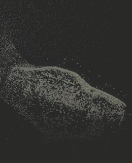

# Collide with Signed Distance Field

菜单路径：**Collision > Collide with Signed Distance Field**

**Collide with Signed Distance Field** 代码块允许您通过使用 SDF（有向距离场）资源来表示对象的形状，从而创建更复杂的碰撞。这对于与预定资源的精确复杂碰撞非常有用。

要生成有向距离场资源，请使用外部 DCC 工具。

## 代码块兼容性

此代码块兼容于以下上下文：

+   [Update](Context-Update.md)

## 代码块设置

| **设置** | **类型** | **描述** |
| --- | --- | --- |
| **Mode** | Enum | 碰撞形状模式。选项： • **Solid**：粒子不能进入碰撞体。   • **Inverted**：粒子不能离开碰撞体。碰撞体成为粒子无法退出的体积。 |
| **Radius Mode** | Enum | 决定每个粒子碰撞半径的模式。选项：   • **None**：粒子的半径为零。   • **From Size**：粒子从它们各自的大小继承半径。   • **Custom**：允许您将粒子的半径设置为特定值。 |
| **Rough Surface** | Bool | 切换碰撞体是否模拟粗糙表面。启用后，Unity 会向粒子反弹的方向添加随机性，以模拟与粗糙表面的碰撞。 |

## 代码块属性

| **Input** | **类型** | **描述** |
| --- | --- | --- |
| **Distance Field** | SDF | 指定碰撞体积形状的有向距离场资源。 |
| **Field Transform** | [Transform](Type-Transform.md) | 决定 **Distance Field** 位置、大小和旋转的变换。 |
| **Bounce** | Float | 碰撞后应用于粒子的反弹量。值为 0 表示粒子不会反弹。值为 1 表示粒子以与它们撞击的相同速度弹开。 |
| **Friction** | Float | 粒子在碰撞过程中损失的速度。最小值为 0。 |
| **Lifetime Loss** | Float | 粒子在碰撞后失去的生命比例。 |
| **Roughness** | Float | 粒子与表面碰撞后随机调整方向的量。   此属性仅在启用 **Rough Surface** 时显示。 |
| **Radius** | Float | 此代码块用于碰撞检测的粒子半径。   此属性仅在将 **Radius Mode** 设置为 **Custom** 时显示。 |
