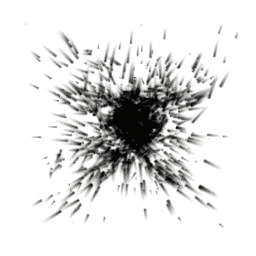

# Conform to Signed Distance Field

菜单路径：**Force > Conform to Signed Distance Field**

**Conform to Signed Distance Field** 代码块将粒子吸引到定义的距离场。这很适合用于将粒子拉向无法通过其他力块轻松定义的特定形状，与其他力一起使用时效果最佳。

## 代码块兼容性

此代码块兼容于以下上下文：

+   [Update](Context-Update.md)

## 代码块属性

| **Input** | **类型** | **描述** |
| --- | --- | --- |
| **Distance Field** | Texture3D | 粒子依从的有向距离场纹理。 |
| **Field Transform** | [Transform](Type-Transform.md) | 用于定位、缩放或旋转距离场的变换。 |
| **Attraction Speed** | Float | 此代码块将粒子吸引到有向距离场的速度。 |
| **Attraction Force** | Float | 设置将粒子拉向有向距离场的力的强度。 |
| **Stick Distance** | Float | 粒子试图粘附到有向距离场的距离。 |
| **Stick Force** | Float | 将粒子保持在有向距离场上的力的强度。 |
