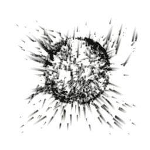

# Conform to Sphere

菜单路径：**Force > Conform to Sphere**

**Conform to Sphere** 代码块将粒子吸引到定义的球体。这适用于很多种用例（例如模拟“充电”能量效果），并且在与其他力一起使用时效果最佳。

此 Operator 不支持具有不同长度的缩放轴（椭球体）的球体。如果使用椭球体作为输入，则此 Operator 使用其最长轴来定义球体。

## 代码块兼容性

此代码块兼容于以下上下文：

+   [Update](Context-Update.md)
  
## 代码块属性

| **Input** | **类型** | **描述** |
| --- | --- | --- |
| **Sphere** | Sphere | 粒子依附到的球体。 |
| **Attraction Speed** | Float | 此代码块将粒子吸引到球体表面的速度。 |
| **Attraction Force** | Float | 将粒子拉向球体的力的强度。 |
| **Stick Distance** | Float | 粒子试图粘附到球体的距离。 |
| **Stick Force** | Float | 将粒子保持在球体上的力的强度。 |
