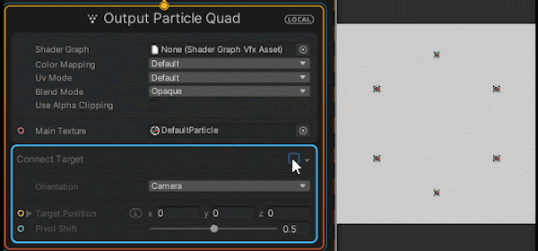
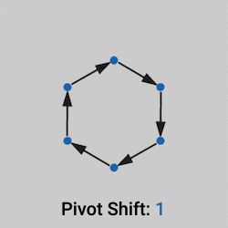

# Connect Target

菜单路径：**Orientation > Connect Target**

**Connect Target** 代码块对粒子进行缩放和定向，使其能够连接到指定的目标位置。

该代码块还允许您指定与粒子位置和目标位置相关的粒子枢轴。例如，这对于指定沿粒子的自定义旋转点很有用：

## 代码块兼容性

此代码块兼容于以下上下文：

+   任何输出上下文

## 代码块设置

| **设置** | **类型** | **描述** |
| --- | --- | --- |
| **Orientation** | Enum | 指定粒子如何设定自身方位。选项：   • **Camera**：粒子面向摄像机。   • **Direction**：粒子面向特定方向。   • **Look At Position**：粒子面向场景中的一个位置。 |

## 代码块属性

| **Input** | **类型** | **描述** |
| --- | --- | --- |
| **Target Position** | [Position](Type-Position.md)  | 粒子连接的位置。 |
| **Look Direction** | [Direction](Type-Direction.md) | 粒子面向的方向。  此属性仅在将 **Orientation** 设置为 **Direction** 时显示。 |
| **Look At Position** | [Position](Type-Position.md)  | 粒子对自身定向以朝向的位置。   此属性仅在将 **Orientation** 设置为 **Look At Position** 时显示。 |
| **Pivot Shift** | float | 相对于粒子长度的枢轴。值为 0 将其设置在粒子位置，而值为 1 将其设置在 **Target Position**。 |
