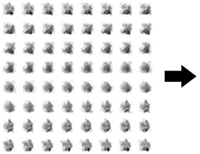
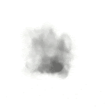
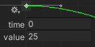

# Flipbook Player

菜单路径：**FlipBook > Flipbook Player**

**Flipbook Player** 代码块使用翻页纹理创建动画粒子。为此，它会逐渐增加每个粒子的 **Tex Index** 属性。

翻页纹理是由多个较小的子图像组成的纹理表。为了制作动画，Unity 会按特定顺序逐步展示子图像。

要生成翻页动画，请使用外部数字内容创建工具。

要设置输出使用翻页，请将其 **UV Mode** 更改为 **Flipbook**、**Flipbook Blend** 或 **Flipbook Motion Blend**。有关不同 UV Mode 的更多信息，请参阅各种输出上下文的文档。

## 代码块兼容性

此代码块兼容于以下上下文：

- [Update](Context-Update.md)

## 代码块设置

| **设置** | **类型** | **描述** |
| --- | --- | --- |
| **Mode** | Enum | 指定如何定义翻页的帧率，以每秒帧数为单位。选项：   • **Constant**：使用恒定帧率。   • **Curve**：使用曲线控制帧率。该曲线定义了粒子生命周期内的帧率。 |

## 代码块属性

| **Input** | **类型** | **描述** |
| --- | --- | --- |
| **Frame Rate** | Float | 以每秒图像帧数设置翻页速率。仅当 **Mode** 设置为 **Constant** 的情况下，才显示此属性。 |
| **Frame Rate** | Curve | 通过曲线在粒子生命周期内设置翻页速率（以每秒图像帧数为单位）。时间 0 处的曲线值为粒子出生时的帧率，时间 1 处的值为粒子到达生命周期时的帧率。    此属性仅在将 **Mode** 设置为 **Constant** 时显示。 |
