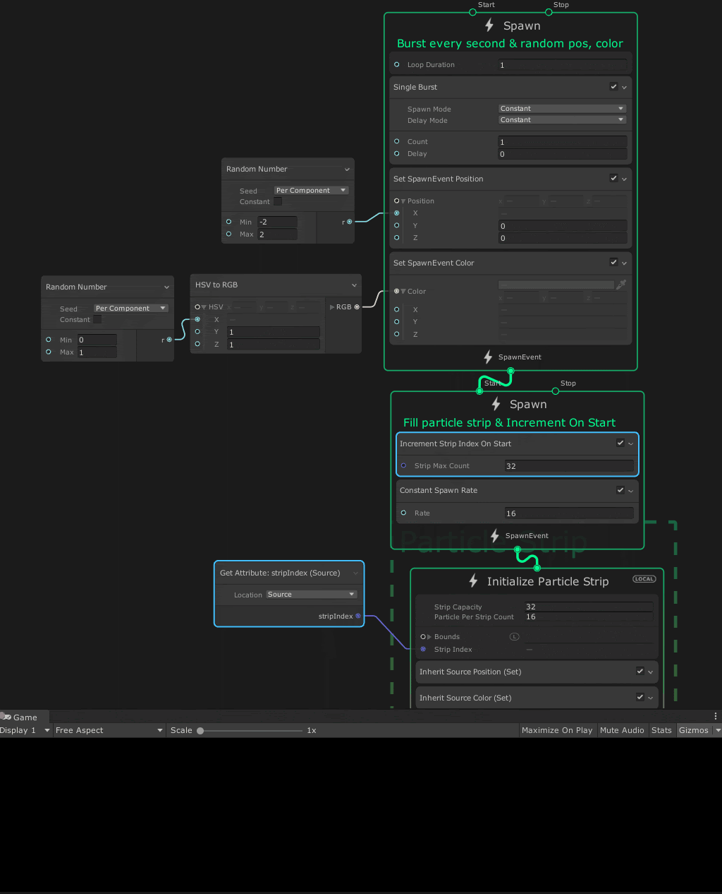

# Increment Strip Index On Start

菜单路径：**Spawn > Custom > Increment Strip Index On Start**

**Increment Strip Index On Start** 代码块有助于管理 Particle Strips 的初始化。Particle Strip 由链接的粒子组组成，这些组的数量由粒子带的 stripIndex 属性定义。每次触发 Spawn Context 的 start 事件时，此代码块都会增加 Particle Strip 的 stripIndex 属性（无符号整数）。这会向 Particle Strip 添加一个新的链接粒子组。

当 stop 事件触发或在 stripIndex 达到 **Strip Max Count** 时，stripIndex 属性返回为 0。这会返回到第一个粒子带组索引。

## 代码块兼容性

此代码块兼容于以下上下文：

- [Spawn](Context-Spawn.md)

## 代码块属性

| **Input** | **类型** | **描述** |
| --- | --- | --- |
| **Strip Max Count** | uint | stripIndex 可以使用的最大值。stripIndex 的范围介于零和此值减一之间。 |

## 备注

此代码块使用 VFXSpawnerCallback 接口，您可以将其用作创建自己的实现的参考。此代码块的实现在 **com.unity.visualeffectgraph > Runtime > CustomSpawners > IncrementStripIndexOnStart.cs** 中。
