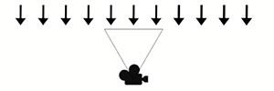
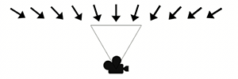
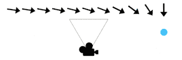
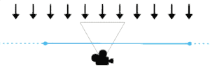
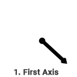
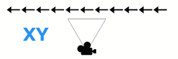
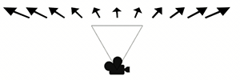

## Orient: Face [Mode]

菜单路径：**Orientation > Orient: Face [Mode]**

**Orient** 代码块使粒子自定向以面向特定方位。它支持多种不同的模式：

**Face Camera Plane**

粒子定向为朝向摄像机平面。此模式适用于大多数用例，但屏幕边缘位置的朝向视觉效果有时会被破坏。

**Face Camera Position**

粒子定向为朝向摄像机位置。类似于 **Face Camera Plane** 模式，但这里的粒子面向摄像机本身，即使在屏幕边缘看起来也毫无差异。

**Look At Position**

粒子定向为朝向指定位置。

**Look At Line**

粒子定向为朝向沿无限长线方向最近的点。

**Advanced**

粒子定向到使用两个指定轴定义的自定义粒子空间。第一个轴是不可变的，代码块使用第二个轴派生第三个轴。然后，它重新计算第二个轴以创建一个正交粒子空间。

这是一种高级模式，您可以使用它来创建自定义方向行为。

**Fixed Axis**

粒子在指定的“向上”轴上自定向，并在其上旋转以面向摄像机。这对于像草这样的效果非常有用，在这种效果中，向上轴通常是已知的，而且在顶部视角下，粒子应该在其上旋转以面向摄像机，而不会平贴在地面上。

**Along Velocity**

粒子根据 **Velocity** 属性定向为面向它们移动的方向。向上轴设置为速度，粒子在其上旋转以根据需要将自身定向到摄像机。

## 代码块兼容性

此代码块兼容于以下上下文：

+   任何输出上下文

## 代码块设置

| **设置** | **类型** | **描述** |
| --- | --- | --- |
| **Mode** | Enum | 指定粒子的方向模式。选项：   • [Face Camera Plane](#face-camera-plane)：粒子定向为朝向摄像机平面。   • [Face Camera Position](#face-camera-position)：粒子定向为朝向摄像机位置。   • [Look At Position](#look-at-position)：粒子定向为朝向您指定的位置。   • [Look At Line](#look-at-line)：粒子定向为朝向您指定的直线上离它们最近的点。 • [Advanced](#advanced)：粒子定向到您使用两个轴定义的自定义粒子空间。 • [Fixed Axis](#fixed-axis)：粒子在您指定的“向上”轴上定向并在其上旋转以面向摄像机。 • [Along Velocity](#along-velocity)：粒子基于 **Velocity** 属性定向为面向它们移动的方向。 |
| **Axes** | Enum | 用于定向粒子的两个轴。有关该代码块如何定向粒子的信息，请参见 [Advanced mode](#advanced)。选项： • **XY**：使用 **X** 和 **Y** 轴定向粒子。 • **YZ**：使用 **Y** 轴和 **Z** 轴定向粒子。 • **ZX**：使用 **Z** 轴和 **X** 轴定向粒子。 • **YX**：使用 **Y** 轴和 **X** 轴定向粒子。 • **ZY**：使用 **Z** 轴和 **Y** 轴定向粒子。 • **XZ**：使用 **X** 轴和 **Z** 轴定向粒子。   此设置尽在 **Mode** 设置为 **Advanced** 时显示。 |

## 代码块属性

| **Input** | **类型** | **描述** |
| --- | --- | --- |
| **Position** | [Position](Type-Position.md) | 粒子将自身定向的方向。   此属性仅在将 **Mode** 设置为 **Look At Position** 时显示。 |
| **Line** | [Line](Type-Line.md) | 用于粒子方向的线。粒子定向为朝向该直线方向上最接近的点。   此属性仅在将 **Mode** 设置为 **Look At Line** 时显示。 |
| **Axis X** | [Vector](Type-Vector.md) | Advanced 方向的 x 轴。   此属性仅在将 **Mode** 设置为 **Advanced** 且 **Axes** 使用 **X** 轴时显示。 |
| **Axis Y** | [Vector](Type-Vector.md) | 指定 Advanced 方向的 y 轴。  此属性仅在将 **Mode** 设置为 **Advanced** 且 **Axes** 使用 **Y** 轴时显示。 |
| **Axis Z** | [Vector](Type-Vector.md) | 指定 Advanced 方向的 z 轴。   此属性仅在将 **Mode** 设置为 **Advanced** 且 **Axes** 使用 **Z** 轴时显示。 |
| **Up** | [Vector](Type-Vector.md) | 指定粒子的向上轴。粒子仅通过在此处指定的固定轴上旋转来将自身定向到摄像机。   此属性仅在将 **Mode** 设置为 **Fixed Axis** 时显示。 |
