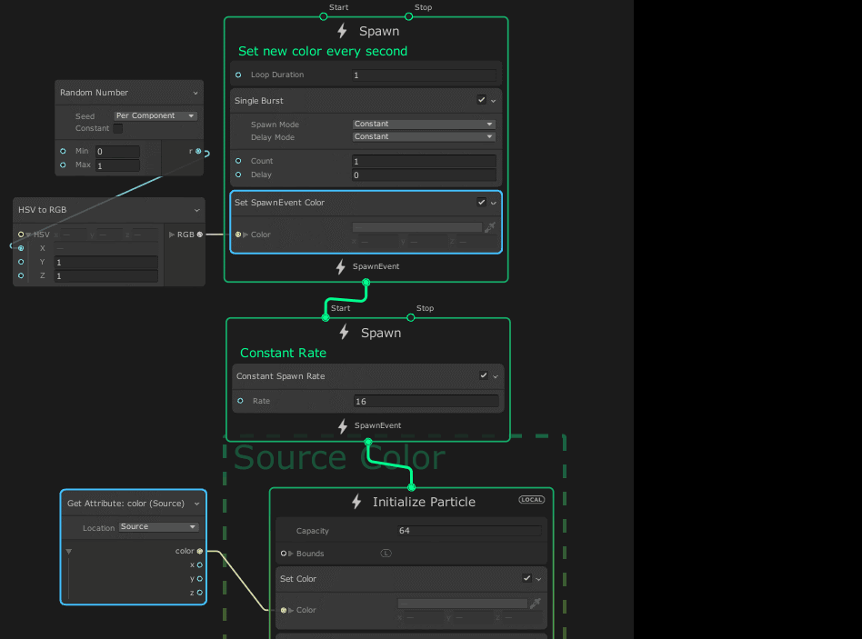

# Set SpawnEvent <Attribute>

菜单路径：**Spawn > Set SpawnEvent <Attribute>**

**Set SpawnEvent** 代码块修改存储在 Context 中的属性内容 [event 属性](https://docs.unity3d.com/2019.3/Documentation/ScriptReference/VFX.VFXSpawnerState-vfxEventAttribute.html)。

## 代码块兼容性

此代码块兼容于以下上下文：

- [Spawn](Context-Spawn.md)

## 代码块设置

| **Input** | **类型** | **描述** |
| --- | --- | --- |
| **Attribute** | Enum | **（检查器）**指定要为其设置值的属性。 |
| **Random Mode** | Enum | **（检查器）**确定系统是否以及如何随机化属性值。选项： • **Off**：不计算属性的随机值。使用您在输入中直接提供的值。   • **Per Component**：为每个属性的组件计算一个随机值。   • **Uniform**：计算单个随机值并将其用于属性的所有组件。 |

## 代码块属性

| **Input** | **类型** | **描述** |
| --- | --- | --- |
| **<Attribute name>** | 取决于属性 | 要设置属性的值。   此属性仅在将 **Random Mode** 设置为 **Off** 时显示。 |
| **Min** | 取决于属性 | 此代码块可以将属性设置成的最小值。   此属性仅在将 **Random Mode** 设置为 **Per Component** 或 **Uniform** 时显示。 |
| **Max** | 取决于属性 | 此代码块可以将属性设置成的最大值。   此属性仅在将 **Random Mode** 设置为 **Per Component** 或 **Uniform** 时显示。 |

## 备注

系统会自动在 spawn 事件之间传输 event 属性，但是，要在 Initialize Context 中检索 spawn 事件，您必须使用 **Inherit Source Attribute** 或 Get Attribute Operator，**Location** 设置成 **Source**。

