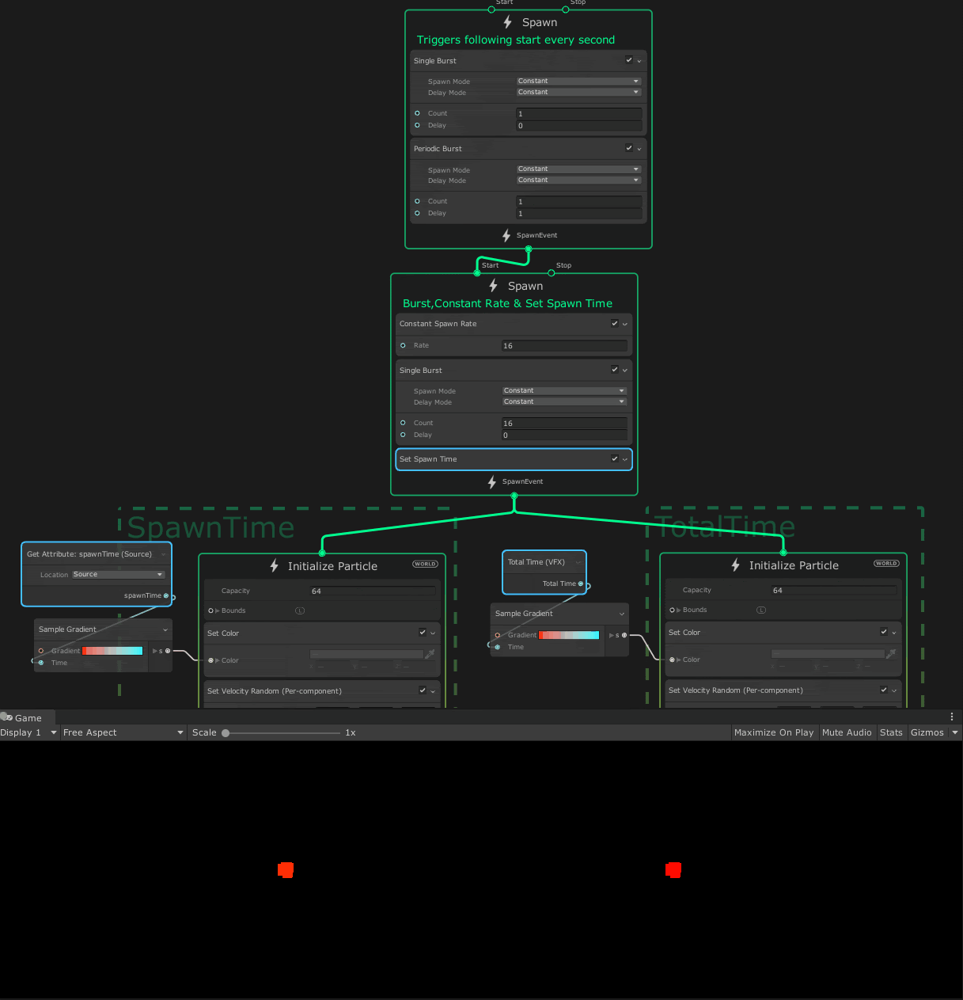

## Set Spawn Time

菜单路径：**Spawn > Custom > Set Spawn Time**

**Set Spawn Time** 代码块允许跟随 Initialize Contexts 使用自 spawn Context 上次播放事件以来的时间（参见 [totalTime](https://docs.unity3d.com/2019.3/Documentation/ScriptReference/VFX.VFXSpawnerState-totalTime.html)）。

在此示例中，左边的系统使用源 spawnTime，它为前一个 spawn 上下文的每个 start 事件进行重置。右侧的系统使用 VFX 总时间，它只是 Visual Effect 组件激活以来 deltaTime 的累积。

## 代码块兼容性

此代码块兼容于以下上下文：

+   [Spawn](Context-Spawn.md)
  

## 备注

此代码块使用 VFXSpawnerCallback 接口，您可以将其用作创建自己的实现的参考。此代码块的实现在 **com.unity.visualeffectgraph > Runtime > CustomSpawners > SetSpawnTime.cs** 中。
