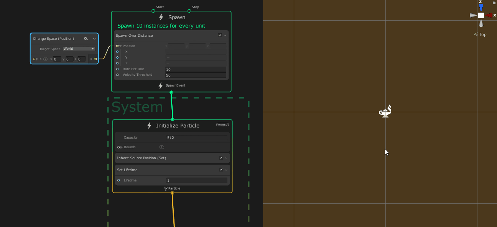

## Spawn Over Distance

菜单路径：**Spawn > Custom > Spawn Over Distance**

**Spawn Over Distance** 代码块计算位置相对于前一帧值的位移。根据位移的大小和 **Rate Per Unit** 属性，系统会生成一个粒子。

## 代码块兼容性

此代码块兼容于以下上下文：

- [Spawn](Context-Spawn.md)

## 代码块属性

| **Input** | **类型** | **描述** |
| --- | --- | --- |
| **Position** | Vector3 | 用于检查是否生成粒子的参考位置。系统会自动将此值存储在位置生成状态属性中。它将先前的值存储在 oldPosition 生成状态属性中。 |
| **Rate per Unit** | float | 每个位移单位生成的粒子数。 |
| **Velocity Threshold** | float | 生成时要考虑的最大速度。如果位置移动速度超过此阈值，则该代码块不再生成任何粒子。 |

## 备注

此代码块使用 VFXSpawnerCallback 接口，您可以将其用作创建自己的实现的参考。此代码块的实现在 **com.unity.visualeffectgraph > Runtime > CustomSpawners > SpawnOverDistance.cs** 中。
