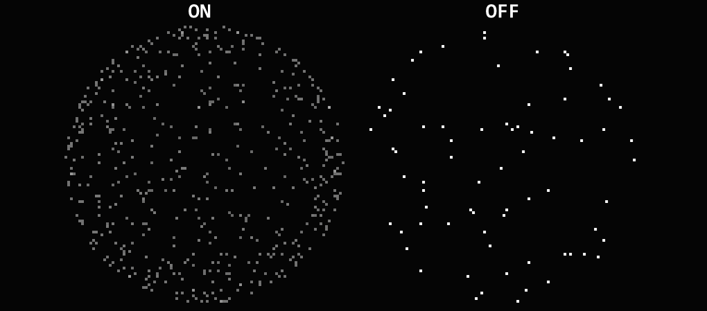

# Subpixel Anti-Aliasing

菜单路径：**Output > Subpixel Anti-Aliasing**

**Subpixel Anti-Aliasing** 代码块强制 ScaleX 和 ScaleY 至少覆盖屏幕的一个像素。如果此代码块放大粒子以使其至少适合一个像素，则它会降低粒子的 alpha 以补偿粒子贡献。

## 代码块兼容性

此代码块兼容于以下上下文：

+   任何输出上下文
