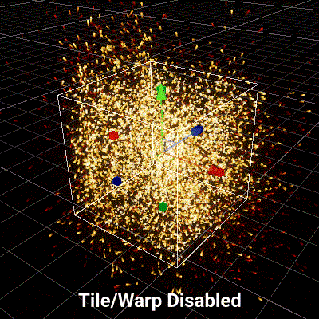

# Tile/Warp Positions

菜单路径：**Position > Tile Warp Positions**

**Tile/Warp Positions** 代码块内包含 [AABox](Type-AABox.md) 内部的粒子，并使这些粒子在空间中无限平铺。从一个面离开体积的粒子，从相反的面重新进入体积，从而使粒子回卷到另一侧。

如果您移动 AABox，这个代码块会在盒体移动时回卷粒子，创建这些粒子的无限平铺。

此代码块可用于创建需要在应用程序中靠近摄像机或播放器的无限平铺效果，例如雨或雪。

## 代码块兼容性

此代码块兼容于以下上下文：

+   [Update](Context-Update.md)
+   任何输出上下文

## 代码块属性

| **Input** | **类型** | **描述** |
| --- | --- | --- |
| **Volume** | [AABox](Type-AABox.md) | 用于平铺的参考 AABox 体积。 |
