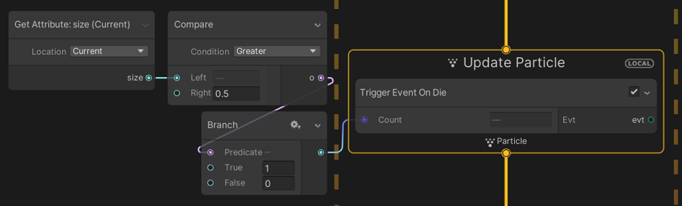

# Trigger Event On Die

菜单路径：**GPU Event > Trigger Event On Die**

**Trigger Event On Die** 代码块通过 [GPU 事件](Context-GPUEvent.md)，在粒子死亡时触发指定数量粒子的创建操作。触发器代码块总是在更新结束时执行，无论代码块位于 Context 中的何处。

您还可以在各种条件下使用 Trigger 代码块来创建更复杂的生成行为：

## 代码块兼容性

此代码块兼容于以下上下文：

+   [Update](Context-Update.md)

## 代码块属性

| **Input** | **类型** | **描述** |
| --- | --- | --- |
| **Count** | Uint | 粒子死亡后生成的 GPU 事件粒子数。 |

| **Output** | **类型** | **描述** |
| --- | --- | --- |
| **Evt** | [GPU 事件](Context-GPUEvent.md) | 要触发的 GPU 事件。 |
