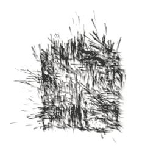

# Turbulence

菜单路径：**Force > Turbulence**

**Turbulence** 代码块生成一个噪声场，它应用于粒子的速度。此代码块可用于为粒子添加看似自然的运动。有关噪声类型的更多信息，请参阅 [Value Curl](Operator-ValueCurlNoise.md)、[Perlin Curl](Operator-PerlinCurlNoise.md) 和 [Cellular Curl](Operator-CellularCurlNoise.md) 噪声运算符。

## 代码块兼容性

此代码块兼容于以下上下文：

+   [Update](Context-Update.md)

## 代码块设置

| **设置** | **类型** | **描述** |
| --- | --- | --- |
| **Mode** | Enum | 此代码块用于向粒子施加力的模式。选项：   • **Absolute**：将力作为绝对值施加到粒子上。   • **Relative**：施加相对于粒子速度的力。 |
| **Noise Type** | Enum | 此代码块用于生成湍流模式的噪声类型。选项：   • **Value**：使用 [Value Curl Noise](Operator-ValueCurlNoise.md) 生成湍流。   • **Perlin**：使用 [Perlin Curl Noise](Operator-PerlinCurlNoise.md) 生成湍流。   • **Cellular**：使用 [Cellular Curl Noise](Operator-CellularCurlNoise.md) 生成湍流。 |

## 代码块属性

| **Input** | **类型** | **描述** |
| --- | --- | --- |
| **Field Transform** | [Transform](Type-Transform.md) | 用于定位、旋转或缩放湍流场的变换。 |
| **Intensity** | Float | 湍流的强度。较高的值会导致粒子速度增加。 |
| **Drag** | Float | 阻力系数。阻力越高，力对粒子速度的影响越大。   此属性仅在将 **Mode** 设置为 **Relative** 时显示。 |
| **Frequency** | Float | Unity 采样噪声的周期。频率越高，导致噪声更改越频繁。 |
| **Octaves** | Uint（滑动条） | 噪声的层数。八度音阶越多，创建的外观越具多样性，但计算也更加耗费资源。 |
| **Roughness** | Float（滑动条） | Unity 应用到每个八度音程的比例因子。Unity 仅在 **Octaves** 设置为大于 1 的值时才使用粗糙度。 |
| **Lacunarity** | Float | 每个连续八度音程的频率变化率。Lacunarity 值为 1 会导致每个八度音程具有相同的频率。 |
