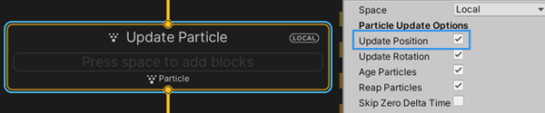

# Integration : Update Position

菜单路径：**Implicit > Integration : Update Position**

**Integration : Update Position** 代码块根据粒子的速度更新粒子位置。如果系统使用速度属性并且您在更新上下文检查器中启用了 **Update Position**，Unity 将隐式地将此代码块添加到上下文中并将其隐藏。

此代码块将粒子速度与 deltaTime 的乘积添加到当前粒子位置：

`position += velocity * deltaTime;`

如果您在更新上下文检查器中禁用了 **Update Position**，则系统不会根据粒子的速度属性更改粒子的 **position**。

您还可以将 **Integration : Update Position** 代码块手动添加到更新上下文，并启用/禁用它以指定系统何时根据粒子速度更新粒子位置。

## 代码块兼容性

此代码块兼容于以下上下文：

- [Update](Context-Update.md)
