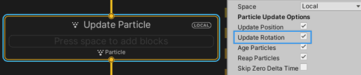

# Integration : Update Rotation

菜单路径：**Implicit > Integration : Update Rotation**

**Integration : Update Rotation** 代码块根据粒子的角速度更新粒子方向。如果系统使用角速度属性并且您在更新上下文检查器中启用了 **Update Rotation**，Unity 将隐式地将此代码块添加到上下文中并将其隐藏。



该代码块将相应的角速度乘以 deltaTime，添加到当前粒子角度：

```
angleX += angularVelocityX * deltaTime;
angleY += angularVelocityY * deltaTime;
angleZ += angularVelocityZ * deltaTime;
```

如果您在更新上下文检查器中禁用了 **Update Rotation**，则系统不会根据粒子的角速度属性更改粒子的方向。

您还可以将 **Integration : Update Rotation** 代码块手动添加到更新上下文，并启用/禁用它以指定系统何时根据粒子速度更新粒子方向。


## 代码块兼容性

此代码块兼容于以下上下文：

- [Update](Context-Update.md)
  