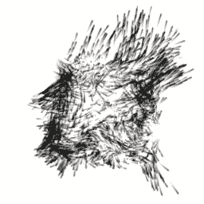
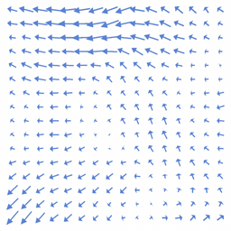

# Vector Field Force

菜单路径：**Force > Vector Field Force**

**Vector Field Force** 代码块使用 [矢量场](VectorFields.md) 向粒子施加力。此代码块可用于添加预先创建并存储在矢量场资源中的特定力。

 矢量场的二维视图

## 代码块兼容性

此代码块兼容于以下上下文：

+   [Update](Context-Update.md)

## 代码块设置

| **设置** | **类型** | **描述** |
| --- | --- | --- |
| **Data Encoding** | Enum | 矢量场数据的编码格式。选项：   • **Signed**：此代码块按原样使用数据（通常用于浮点格式）。   • **Unsigned Normalized**：数据以灰度为中心并进行缩放/偏置（通常为每个分量格式 8 位）。 |
| **Mode** | Enum | 此代码块用于向粒子施加力的模式。选项：   • **Absolute**：将力作为绝对值施加到粒子上。   • **Relative**：施加相对于粒子速度的力。 |
| **Closed Field** | Bool | （**检查器**）指示代码块是否认为矢量场已关闭。如果您启用该复选框，则代码块会认为矢量场已关闭，这意味着它不会影响 **Field Transform** 外部的任何粒子。如果禁用此复选框，则矢量场会回绕，并且代码块影响 **Field Transform** 外部的粒子。 |
| **Conserve Magnitude** | Bool | （**检查器**）指示当 **Field Transform** 的大小发生变化时，代码块是否保留矢量场的幅度。 |

## 代码块属性

| **Input** | **类型** | **描述** |
| --- | --- | --- |
| **Vector Field** | Texture3D | 此代码块用于向粒子施加力的矢量场。 |
| **Field Transform** | [Transform](Type-Transform.md)  | 用于定位、缩放或旋转矢量场的变换。 |
| **Intensity** | Float | 矢量场的强度。值越高，粒子速度越大。 |
| **Drag** | Float | 阻力系数。阻力越高，力对粒子速度的影响越大。   此属性仅在将 **Mode** 设置为 **Relative** 时显示。 |
