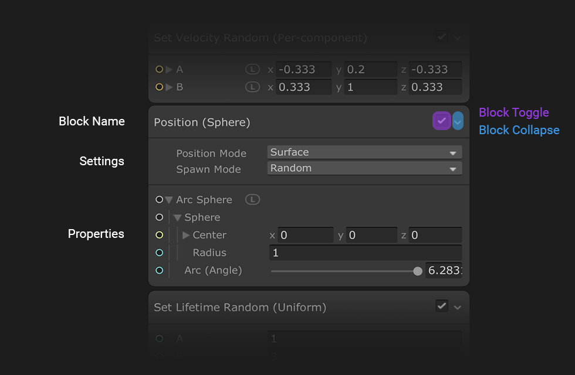

# Blocks 块
ys a visual effect, Blocks execute from top to bottom.
块是定义 [Context](Contexts.md) 行为的节点。您可以在上下文中创建和重新排序块，当 Unity 播放视觉效果时，块会从上到下执行。

您可以将块用于多种用途，从简单的值存储（例如，随机颜色）到高级复杂操作，例如 Noise Turbulence、Forces 或 Collisions。

## 添加块

要将 Block 添加到 Context 中，请执行以下任一操作：

* 右键单击 Context 并从上下文菜单中选择 **Create Block**。
* 将光标置于 Context 上方，按空格键。

**注意**: Unity 会将您创建的 Block 放置在离光标最近的位置。使用此行为可将 Blocks 放置在正确的位置。

## 操纵块

数据块本质上是具有不同工作流逻辑的节点。数据块始终堆叠在一个称为 [Context](Contexts.md) 的容器中，它们的工作流逻辑垂直连接，没有可见的链接。

* 要移动 Block，请点击 Block 的标题并将其拖动到另一个兼容的 Context。

* 要对 Block 重新排序，请点击 Block 的标题并将其拖动到同一 Context 中的不同位置。

* 您还可以剪切、复制、粘贴和复制块。操作步骤：
  * 右键单击 Block 并从上下文菜单中选择命令。
  * 选择 Block 并使用以下 Keyboard 快捷方式：
    * Windows上
      * **Copy**: Ctrl+C.
      * **Cut**: Ctrl+X.
      * **Paste**: Ctrl+V.
      * **Duplicate**: Ctrl+D.
    * OSX上
      * **Copy**: Cmd+C.
      * **Cut**: Cmd+X.
      * **Paste**: Cmd+V.
      * **Duplicate**: Cmd+D.

* 要禁用 Block，请禁用 Block 标题右侧的复选框。这需要您重新编译图形。

## 配置块

要更改 Block 的外观和行为方式，请在 Node UI 或 Inspector 中调整 Block 的 [设置](GraphLogicAndPhilosophy.md#settings)。

例如，如果在 Inspector 中，将 **Set Velocity** 块的 Composition Settings 从 **Overwrite** 更改为 **Blend**，则会将 Node 的标题更改为 **Blend Velocity**，并将 **Blend** 属性添加到节点 UI。
