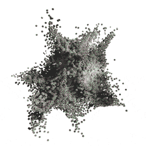

# Output Lit

菜单路径 : **Context > Output [Data Type] Lit [Type]**

*(Output Particle (Lit) Quad, Output Particle (Lit) Mesh, Output ParticleStrip (Lit), 等等。)*

光照输出是输出的一种变体，它可以接收光照信息并支持与光照相关的其他纹理和材质类型。它们在视觉效果需要对场景中的光照做出反应的场景中很有用。

## 渲染管线兼容性

| **功能** | **通用渲染管线(URP)** | **高清渲染管线  (HDRP)** |
| ----------- | ----------------------------------- | ------------------------------------------ |
| Lit outputs | Yes                                 | Yes                                        |

以下是特定于光照输出的设置和属性列表。有关此上下文与所有其他上下文共享的通用输出设置的信息，请参阅 [全局输出设置和属性](Context-OutputSharedSettings.md)。

## 上下文设置

| **设置**                                             | **类型**                                                     | **描述**                                              |
| ------------------------------------------------------- | ------------------------------------------------------------ | ------------------------------------------------------------ |
| **Normal Bending**                                      | Bool                                                         | **(检查器)** 指示此输出是否支持法向弯曲。如果启用此属性，则会显示 **Normal Bending Factor** 滑块，您可以使用该滑块来调整法线的曲率。 此属性仅显示在 **Lit Planar Primitives** （quad， triangle， octagon） 和 **Lit Particle Trips** 上。 |
| **Material Type [HDRP]**                     | Enum                                                         | **(检查器)** **(HDRP)**  指定输出的表面类型。这决定了粒子对光线的反应方式。选项包括：  &#8226; **Standard**:  支持大多数光照功能的标准光照材质。 &#8226; **Specular Color**: 允许您手动定义镜面颜色。 &#8226; **Translucent**:  使用[Diffusion Profile](https://docs.unity.cn/cn/Packages-cn/com.unity.render-pipelines.high-definition@latest/index.html?subfolder=/manual/Diffusion-Profile.html)以模拟光线穿过粒子。 &#8226; **Simple Lit**: 允许您切换特定的照明计算以提高性能。在此模式下，只有点光源、聚光灯和方向光会影响粒子。此模式。此模式以向前模式渲染粒子。 &#8226; **Simple Lit Translucent**: 类似于 **Simple Lit**，但具有 Translucent 工作流程，用于模拟光线穿过对象。 &#8226; **Six Way Smoke Lit**: 使用存储在 **Positive Axes Light Map** 和 **Negative Axes Light Map** 中的烘焙烟雾数据来模拟逼真的烟雾照明。 |
| **Workflow Mode** **[URP]**                  | Enum                                                         | **(检查器)** 指定输出的表面类型。这决定了粒子对光线的反应方式。选项包括： &#8226; **Metallic**:  标准光照材质，可显示 **Metallic** 滑块。 &#8226; **Specular**: 允许您手动定义 **Specular Color**，这样就可以获得与漫反射颜色不同的镜面反射。 |
| **Smoothness Source** **[URP]**              | Enum                                                         | **(检查器)** 指定平滑度贴图源。它可以是 Metallic Map、Base Color Map 或 Specular Map（如果在输出中使用）的 Alpha 通道。仅当启用了相应的映射时，单个枚举选项才可用。 |
| **Only Ambient Lighting** **[HDRP]**         | Bool                                                         | **(检查器)** 指示输出粒子是否仅接收来自环境光源和光照探针的光。禁用此设置可让粒子从场景中的所有光源接收照明。 |
| **Use Base Color Map**                                  | Enum                                                         | **(检查器)** 指定要应用于输出的基础颜色映射表的哪些部分。选项包括： &#8226; **None**: 不将基础颜色映射应用于输出。 &#8226; **Color**: 仅将基础颜色映射的颜色通道应用于输出。 &#8226; **Alpha**: 仅将基础颜色映射的 Alpha 通道应用于输出。 &#8226; **Color and Alpha**: 将基础颜色映射的颜色通道和 Alpha 通道应用于输出。 |
| **Use Mask Map** **[HDRP]**                  | Bool                                                         | **(检查器)** 指示输出是否接受遮罩贴图输入以控制粒子接收光照的方式。 |
| **Use Occlusion Map** **[URP]**              | Bool                                                         | **(检查器)** 指示输出是否接受 Occlusion Map 来模拟环境照明的阴影。 |
| **Use Metallic Map** **[URP]**               | Bool                                                         | **(检查器)** 指示输出是否接受金属贴图以将金属度值乘以。 仅当将 **Workflow Mode** 设置为  **Metallic** 时，才会显示此属性。 |
| **Use Specular Map** **[URP]**               | Bool                                                         | **(检查器)** 指示输出是否接受将镜面反射值乘以的镜面反射贴图。 仅当将 **Workflow Mode** 设置为 **Specular** 时，才会显示此属性。 |
| **Use Normal Map**                                      | Bool                                                         | **(检查器)** 指示输出是否接受法线贴图输入，以便在照明时模拟其他表面细节。 |
| **Use Emissive Map**                                    | Bool                                                         | **(检查器)** 指示输出是否接受自发光贴图来控制粒子的发光方式，而与粒子的照明方式无关。 |
| **Color Mode**                                          | Enum                                                         | **(检查器)** 指定如何将每粒子颜色属性应用于粒子。选项包括： &#8226; **None**: Disregards the color attribute. &#8226; **Base Color**: 使用 color 属性作为粒子的基础颜色。 &#8226; **Emissive**: 使用 color 属性作为粒子的自发光颜色。 &#8226; **Base Color and Emissive**: 使用 color 属性作为粒子的基础颜色和自发光颜色。 |
| **Use Emissive**                                        | Bool                                                         | **(检查器)** 指示输出是否支持自发光粒子。启用此设置可显示 **Emissive Color** 属性，您可以使用该属性使粒子发光。 |
| **Double-Sided**                                        | Bool                                                         | **(检查器)** 指示单侧粒子（如四边形）是否应从两侧渲染。当从后面查看粒子时，这会翻转粒子的法线，这意味着它们也会接收到正确的照明信息。 注：如果启用此设置，请将 **Cull Mode** 设置为 **Off**。否则，Unity 会剔除粒子的背面，因此不会渲染粒子的两侧。 |
| **Preserve Specular Lighting** **[HDRP]**    | Bool                                                         | **(检查器)** 启用后，无论粒子的不透明度如何，都将渲染镜面反射照明。此设置对于创建透明粒子仍反射光线的玻璃状效果非常有用。 |
| **Diffusion Profile Asset** **[HDRP]**       | [Diffusion Profile](https://docs.unity.cn/cn/Packages-cn/com.unity.render-pipelines.high-definition@latest/index.html?subfolder=/manual/Diffusion-Profile.html) | **(检查器)** Diffusion Profile （漫射配置文件），用于确定如何模拟穿过粒子的光线。  注： 还必须将 Diffusion Profile 添加到 [HDRP 资源](https://docs.unity.cn/cn/Packages-cn/com.unity.render-pipelines.high-definition@latest/index.html?subfolder=/manual/HDRP-Asset.html**) 或发送到 [Volume’s](https://docs.unity.cn/cn/Packages-cn/com.unity.render-pipelines.high-definition@latest/index.html?subfolder=/manual/Volumes.html) [Diffusion Profile Override](https://docs.unity.cn/cn/Packages-cn/com.unity.render-pipelines.high-definition@latest/index.html?subfolder=/manual/Override-Diffusion-Profile.html) 在 Scene 中。 仅当你将 **Material Type** 设置为 **Translucent** 或 **Simple Lit Translucent** 时，才会显示此设置。 |
| **Multiply Thickness With Alpha** **[HDRP]** | Bool                                                         | **(检查器)** 指示是否将粒子的 **Thickness** 乘以其 Alpha 值。 仅当你将 **Material Type** 设置为 **Translucent** 或 **Simple Lit Translucent** 时，才会显示此设置。 |
| **Smoke Emissive Mode** **[HDRP]**           | Enum                                                         | **(检查器)** 指定 HDRP 用于控制粒子的自发光颜色的信息： &#8226; **None**: 粒子没有自发光颜色。 &#8226; **Single Channel**: 使用 **Negative Axes Light Map** 的 Alpha 通道检索发射强度，并使用 **Emissive Gradient** 将此值重新映射为自发光颜色。 &#8226; **Map**: 使用 **Emissive Map**。 |
| **Receive Shadows** **[HDRP]**               | Bool                                                         | **(检查器)** 指示粒子是否接收阴影。 仅当将 **Material Type** 设置为 **Simple Lit、Simple Lit Translucent** 或 **Six Way Smoke Lit** 时，才会显示此设置。 |
| **Enable Specular** **[HDRP]**               | Bool                                                         | **(检查器)** 指示粒子是否接收镜面反射高光。 仅当将 **Material Type** 设置为 **Simple Lit** 或 **Simple Lit Translucent** 时，才会显示此设置。 |
| **Enable Cookie** **[HDRP]**                 | Bool                                                         | **(检查器)** 指示灯光剪影是否影响粒子。仅当将 **Material Type** 设置为 **Simple Lit、Simple Lit Translucent** 或 **Six Way Smoke Lit** 时，才会显示此设置。 |
| **Enable Env Light** **[HDRP]**              | Bool                                                         | **(检查器)** 指示粒子是否接收在全局[Volume Profile](https://docs.unity.cn/cn/Packages-cn/com.unity.render-pipelines.high-definition@latest/index.html?subfolder=/manual/Volume-Profile.html)。  仅当将 **Material Type** 设置为 **Simple Lit** 或 **Simple Lit Translucent** 时，才会显示此设置。 |

## 上下文属性

| **属性**                              | **类型**       | **描述**                                              |
| -------------------------------------- | -------------- | ------------------------------------------------------------ |
| **Smoothness**                         | Float (滑块) | 粒子的平滑度。更平滑的表面会更均匀地反射光线，从而产生更清晰的反射。 |
| **Metallic**                           | Float (滑块) | 颗粒的金属丰度。金属表面更能反映其环境，从而使其反照率颜色不太明显。
仅当 **Material Type** 设置为 **Standard** 或 **Simple Lit** 时，才会显示此属性。 |
| **Occlusion Map** **[URP]** | Texture2D      | 控制材质表面的遮挡。有关遮挡映射及其效果的更多信息，请参阅[Occlusion mapping](https://docs.unity3d.com/Manual/StandardShaderMaterialParameterOcclusionMap.html)。 T仅当启用 **Use Occlusion Map** 时，才会显示此属性 |
| **Specular Map** **[URP]**  | Texture2D      | 控制材质表面的镜面反射颜色。为了获得最终的镜面反射强度值，Unity 将此值乘以 **Specular Color**。 T仅当启用 **Use Specular Map** 时，才会显示此属性。 |
| **Metallic Map** **[URP]**  | Texture2D      | 控制整个材质表面的金属度。为了获得最终的金属丰度值，Unity 会将该值乘以 **Metallic**。 仅当启用 **Use Metallic Map** 时，才会显示此属性。 |
| **Normal Bending Factor**              | Float (滑块) | 弯曲法线的量。弯曲的法线越多，创建的外观就越圆润。 此属性仅在启用 **Normal Bending** 时显示。 |
| **Thickness** **[HDRP]**    | Float (滑块) | T半透明粒子的厚度。这会影响 **Diffusion Profile** 资源的影响。 仅当 **Material Type** 设置为 **Translucent** 或 **Simple Lit Translucent** 时，才会显示此属性。 |
| **Base Color Map**                     | Texture2D      | 粒子的基色 （RGB） 和不透明度 （A）。 仅当将 **Use Base Color Map** 设置为除 'None' 以外的任何值时，才会显示此属性。 |
| **Mask Map** **[HDRP]**     | Texture2D      | 粒子 - 金属感 （R）、环境光遮蔽 （G） 和平滑度 （A）的 [mask map](https://docs.unity.cn/cn/Packages-cn/com.unity.render-pipelines.high-definition@latest/index.html?subfolder=/manual/Mask-Map-and-Detail-Map.html) 。 仅当启用 **Use Normal Map** 时，才会显示此属性。 |
| **Normal Map**                         | Texture2D      | 系统用于在切线空间中获取粒子法线的法线贴图。 仅当启用 **Use Normal Map** 时，才会显示此属性。 |
| **Emissive Map**                       | Texture2D      | 系统用于使粒子发光的自发光贴图 （RGB）。 此属性仅在您启用 Use **Emissive Map**时显示。 |
| **Positive Axes Light Map**            | Texture2D      | 包含每个纹理通道中正轴的照明数据的纹理： &#8226; Right (R)  &#8226; Up (G)  &#8226; Back (B)  &#8226; Opacity (A)  此属性仅在将 **Material Type** 设置为 **Six Way Smoke Lit**时显示。 |
| **Negative Axes Light Map**            | Texture2D      | 包含每个纹理通道中正轴的照明数据的纹理： &#8226; Left (R)  &#8226; Bottom (G)  &#8226; Front (B)  &#8226; Emissive Mask (A): 当您使用**单通道**烟雾自发光模式时，请选择此选项。  仅当将 **Material Type** 设置为 **Six Way Smoke Lit** 时，才会显示此属性。 |
| **Emission Gradient**                  | Gradient       | TUnity 用于从 **Negative Axes Light Map** 的 Alpha 通道对自发光颜色进行采样的渐变。仅当将 **Material Type** 设置为 **Six Way Smoke Lit** 时，才会显示此属性。 |
| **Emission Multiplier**                | Float          | Unity 将 **Emission Gradient** 中的值乘以的量。  仅当将 **Material Type** 设置为 **Six Way Smoke Lit** 时，才会显示此属性。 |
| **Alpha Remap**                        | Curve          | 使用曲线重新映射粒子的不透明度值。 仅当将 **Material Type** 设置为 **Six Way Smoke Lit** 时，才会显示此属性。 |
| **Base Color**                         | Color          | 粒子的基色。 仅当 **Color Mode** 设置为 **None** 时，才会显示此属性。 |
| **Emissive Color**                     | Color          | 系统用于使粒子发光的自发光颜色。 此属性仅在您启用 **Use Emissive** 时显示。 |
| **Specular Color**                     | Color          | 粒子的镜面反射颜色。 仅当 **Material Type** 设置为 **Specular Color** 或 **Workflow Mode** 设置为 **Specular** 时，才会显示此属性。 |
