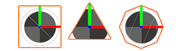

# Output Particle Primitive

菜单路径 : **Context > Output Particle [Primitive]**
*(Output Particle (Lit) Quad, Output Particle (Lit) Triangle, Output Particle (Lit) Octagon)*

The Output Particle primitives 四边形/三角形/八边形）上下文是最常用的输出类型，适用于各种效果。它们有一个常规（无光照）和一个 [Lit](Context-OutputLitSettings.md) （仅限 HDRP）两种形式。

此上下文支持以下平面图元：

* **Quad:** 一个标准的矩形粒子，在大多数情况下都很有用。
* **Triangle:** 与四边形粒子相比，几何体只有一半，三角形图元可用于快速移动的效果或渲染许多粒子的效果。
* **Octagon:** 八边形图元可用于以增加额外几何体为代价减少过度绘制，可用于紧密贴合粒子纹理并避免渲染不必要的透明区域。

以下是特定于 Output Particle Primitive 上下文的设置和属性列表。有关此上下文与所有其他上下文共享的通用输出设置的信息，请参阅 [全局输出设置和属性](Context-OutputSharedSettings.md)。

## 上下文设置

|**设置**|**类型**|**描述**|
|---|---|---|
|**Primitive Type**|Enum|**(检查器)** 指定此 Context 用于渲染每个粒子的基元。选项包括： &#8226; **Quad**: 将每个粒子渲染为四边形。 &#8226; **Triangle**: 将每个粒子渲染为三角形。 &#8226; **Octagon**: 将每个粒子渲染为八边形。|

## 上下文属性

|**输入**|**类型**|**描述**|
|---|---|---|
|**Crop Factor**|float|	裁剪八边形粒子形状的量。这消除了透明像素，从而实现更紧密的配合并减少潜在的过度绘制。 此属性仅在将 **Primitive Type** 设置为 **Octagon** 时显示。|
