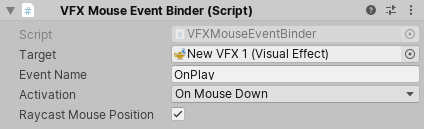
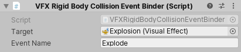
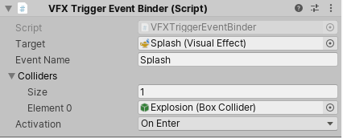
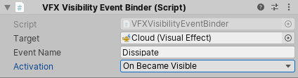

<b>实验性:</b> 此功能目前是实验性的，在以后的主要版本中可能会发生变化。要使用此功能，请在工程 Preferences 的 <b>Visual Effects</b> 选项卡中启用 <b>Experimental Operators/Blocks</b>。

# 事件绑定器

事件绑定器是指一组 **MonoBehaviour** 脚本，可帮助您在场景中发生特定事件时触发 Visual Effects 中的[事件](Events.md)。例如，当 Renderer 变为可见时。事件绑定器还可以将 [Event Attribute Payloads](Events.md#eventattribute-payloads) 附加到它们发送的事件。

## 鼠标事件绑定器

鼠标事件绑定器根据您使用鼠标执行的操作（例如，单击、悬停或拖动）触发目标 Visual Effect 中的事件。

**要求**：与此组件位于同一游戏对象上的 Collider。

**属性:**

| **属性**               | **描述**                                              |
| -------------------------- | ------------------------------------------------------------ | 
| **Target**                 | 要在其上触发事件的视觉特效实例。          |
| **Event Name**             | 要触发的事件的名称。                           |
| **Activation**             | 指定此组件何时触发事件： &#8226; **OnMouseDown**: 当您按下碰撞体时。 &#8226; **OnMouseUp**: 当您释放对 Collider 的单击时。 &#8226; **OnMouseEnter**: 当光标进入 Collider 的屏幕区域时。 &#8226; **OnMouseExit**: 当光标退出 Collider 的屏幕区域时。 &#8226; **OnMouseOver**: 当光标悬停在 Collider 的屏幕区域上时。 &#8226; **OnMouseDrag**:当您将鼠标拖动到碰撞体的屏幕区域上时。 |
| **Raycast Mouse Position** | 指定是否使用 `position` EventAttribute 作为向碰撞体投射光线的结果。 |

## 刚体碰撞事件绑定器

每次有物体与附加到与此组件相同的游戏对象的刚体发生碰撞时，Rigid Body Collision Event Binder 都会在目标 Visual Effect 中触发一个 Event。此 Binder 还将碰撞世界位置附加到 `position` EventAttribute，并将接触 Normal 附加到 `velocity` EventAttribute。

**要求:** 与此组件位于同一游戏对象上的 Rigidbody 和 Collider。

**属性:**

| **属性** | **描述**                                     |
| -------------- | --------------------------------------------------- |
| **Target**     | 触发 Event 的 Visual Effect 实例。 |
| **Event Name** | 要触发的事件的名称。                  |

## 触发器事件绑定器

每当列表中的碰撞体与附加的触发器碰撞体交互时，Trigger Event Binder 都会在目标 Visual Effect 中触发一个 Event。此 Binder 还将 Collider 发起方的世界位置附加到 `position` EventAttribute。

**要求:** 与此组件相同的GameObject上，具有 **Is Trigger** 的对撞机设置为`true`。

**属性:**

| **属性**   | **描述**                                              |
| -------------- | ------------------------------------------------------------ |
| **Target**     | 触发 Event 的 Visual Effect 实例。          |
| **Event Name** | T要触发的 Event 的名称。                         |
| **Colliders**  | 	当有对象与碰撞体交互时触发 Event 的碰撞体列表。 |
| **Activation** | 指定触发 Event 的操作： &#8226; **OnEnter**: 当任何 Collider 进入触发器时触发 Event。 &#8226; **OnExit**: 当任何 Collider 退出触发器时触发 Event。 &#8226; **OnStay**: 当任何 Collider 停留在触发器中时触发 Event。 |

## 可见性事件绑定器

每当附加到此游戏对象的渲染器变为可见或不可见时，Visibility Event Binder 都会在目标 Visual Effect 中触发一个 Event。

**要求:** 与此组件位于同一游戏对象上的 Renderer。

**属性:**

| **属性**   | **描述**                                              |
| -------------- | ------------------------------------------------------------ |
| **Target**     | 触发 Event 的 Visual Effect 实例。         |
| **Event Name** | 要触发的 Event 的名称。                 |
| **Activation** | 指定何时触发事件： &#8226; **OnBecameVisible**: 在 Renderer 从不可见变为可见的帧上触发事件。 &#8226; **OnBecameInvisible**: T在 Renderer 从可见变为不可见的帧上触发 Event。 |
