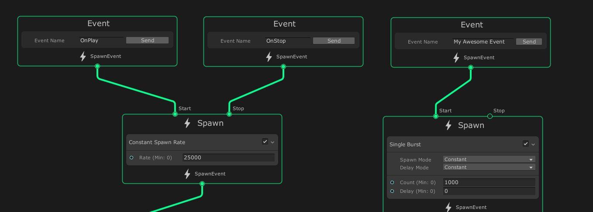
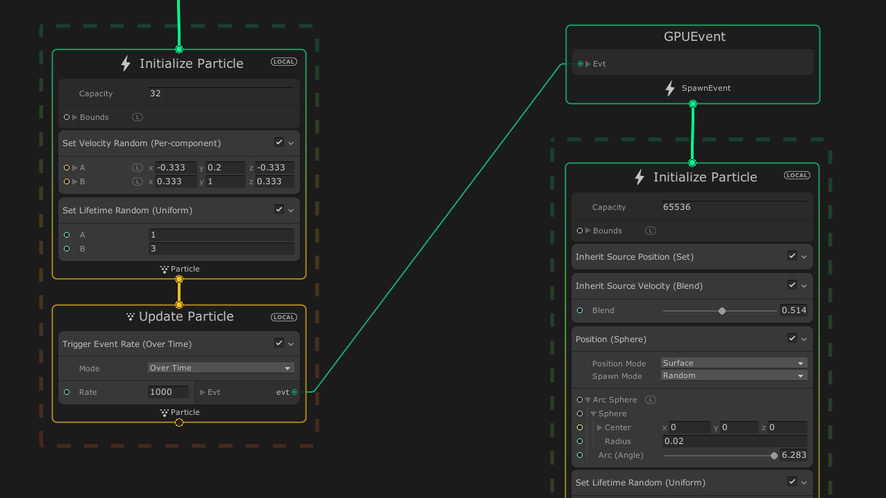

# Events 事件

事件定义 Visual Effect Graph的[**processing** 工作流](GraphLogicAndPhilosophy.md#processing-workflow-(vertical-logic))的输入。Spawn 和 初始化 [上下文](Contexts.md)使用事件作为其输入。通过 Event，Visual Effect Graph 可以：

* 开始和停止生成粒子。
* 读取从 C# 脚本发送的 [事件属性负载](#eventattribute-payloads)。

## 创建事件

通常，Event 只是一个表示 Event 名称的字符串。要在 Visual Effect Graph 中接收事件，请创建一个事件[上下文](Contexts.md)，并在 **Event Name** 属性中键入要接收的事件的名称。事件上下文没有输入流槽，只能将其输出流槽连接到 Spawn 或 Initialize 上下文。

要创建事件上下文：

1. 在 [Visual Effect Graph 窗口](VisualEffectGraphWindow.md)中，右键单击空白区域。
2. 从菜单中，单击 **Create Node** 创建节点。
3. 在 Node Creation 菜单中，单击 **Contexts > Event (Context)**。
4. 在 **Event Name** 输入字段中，键入事件的名称。

## 默认事件

Visual Effect Graph 提供两个默认事件：

- **OnPlay**：启用粒子的生成。如果未将事件分配给 Spawn 上下文的 **Start** input flow 插槽，则 Visual Effect Graph 会将此事件隐式绑定到该输入流插槽。
- **OnStop**：禁用粒子的生成。如果未将事件分配给 Spawn Context 的 **Stop** input flow 插槽，则 Visual Effect Graph 会将此 Event 隐式绑定到该输入流插槽。

如果将事件上下文连接到 Spawn 上下文的 **Start** 或 **Stop** 输入流插槽，则会分别删除对 **OnPlay** 和 **OnStop** 事件的隐式绑定。

## 自定义事件

如果您不想使用默认 Event，则可以使用 Event Context 来创建自己的自定义 Event。

为此，请首先[创建Event Context](#创建事件)，然后在 Event Name 属性中键入自定义 Event 的名称。

## 事件属性有效负载

Event Attribute 负载是您可以附加到 Event 的属性。要在 Visual Effect Graph 中设置这些属性，您可以在 Spawn Contexts 中使用 **Set [Attribute]** Blocks，但也可以将它们附加到从 C# 脚本发送的事件。有关如何执行后者的信息，请参阅[组件API](ComponentAPI.md#event-attributes) 。

Event Attribute Payloads 是隐式穿过图表从 Events 经过 Spawn Contexts，并最终到达 Initialize Context 的属性。若要在 Initialize 上下文中捕获有效负载，请使用 **Get Source Attribute** 运算符或 **Inherit [Attribute]** 块。

## 默认 Visual Effect 事件

默认的 Visual Effect Event 定义 Visual Effect Graph 在 [Visual Effect](VisualEffectComponent.md) 实例**重置**时隐式发送的 Event 的名称。当 effect 首次启动时，或者当 effect 重新启动时，会发生这种情况。

您可以为每个 Visual Effect Graph 资源单独定义默认 [Visual Effect Graph 资源](VisualEffectGraphAsset.md)。您还可以为 Visual Effect Graph 资源的每个实例覆盖此值。要覆盖实例的默认 Visual Effect Event，请参阅 [Visual Effect Inspector](VisualEffectComponent.md) 中的**初始事件名称**。

## GPU 事件

GPU 事件是 Visual Effect Graph 的一项**实验性功能**。它们允许您基于其他粒子生成粒子。要启用此选项，请启用 [Visual Effect Preferences](VisualEffectPreferences.md) 中的 **Experimental Operators/Blocks** 复选框。

GPU 事件是依赖于从其他系统发送的数据的事件上下文，例如，当粒子死亡时。以下更新块可以发送 GPU 事件数据：

- **Trigger Event On Die（死亡时触发事件**）：当粒子死亡时，在另一个系统上生成 N 个粒子。
- **Trigger Event Rate （触发事件速率）**：根据系统中的粒子，每秒（或每行进的距离）生成 N 个粒子。
- **Trigger Event Always（始终触发事件）**：每帧生成 N 个粒子。

这些块连接到 **GPUEvent** 上下文。此 Context 不处理任何 Block，而是连接到子系统的 Initialize Context。

要从父粒子收集数据，子系统必须在其 Initialize Context 中引用 [Source Attributes](Attributes.md)。为此，子系统可以使用 **Get Source Attribute** 运算符或 **Inherit Attribute** 块。有关直观示例，请参阅下图。

*在此示例中，子系统继承创建它的粒子的源位置。它还继承了父粒子大约 50% 的速度。*
