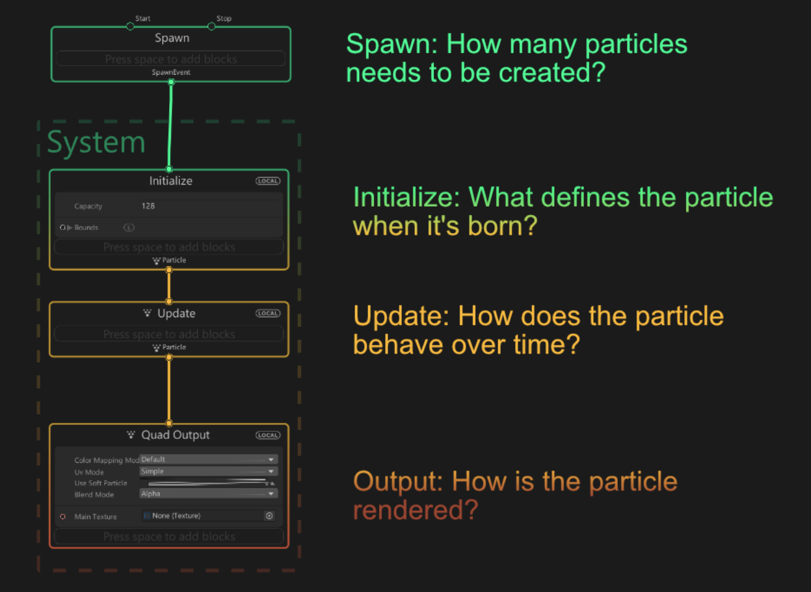

# Visual Effect Graph 逻辑

Visual Effect Graph 使用两种不同的工作流程：

* 一种**处理** （垂直） 逻辑，它将可自定义的阶段链接在一起以定义系统的生命周期。

* 一个**属性** （水平） 逻辑，它连接不同的[Contexts](Contexts.md) 来定义粒子的外观和行为。

## 处理工作流 （垂直逻辑）

处理工作流将一系列可自定义的阶段链接在一起，以定义完整的系统逻辑。您可以在此处确定在效果期间何时生成、初始化、更新和渲染粒子。

处理工作流使用位于上下文节点顶部和底部的**flow slots**连接上下文。

处理逻辑定义视觉效果处理的不同阶段。每个阶段都由一个称为 [Contexts](Contexts.md) 的大型彩色容器组成。每个 Context 都连接到另一个兼容的 Context，该 Context 定义了下一阶段的处理如何使用当前 Context。

上下文可以包含称为 [Blocks](Blocks.md) 的元素。每个 Block 都是一个可堆叠的 Node，负责一个操作。您可以对 Blocks 重新排序以更改 Unity 处理视觉效果的顺序。Unity 从上到下执行 Context 中的 Block。

## 属性工作流 （水平逻辑）

在水平属性工作流中，您可以定义数学运算以增强视觉效果。这会影响粒子的外观和行为。

属性工作流使用其 Blocks 的 **Property Slots** 连接 Context。左侧是输入，右侧是输出。

Visual Effect Graph 附带一个大型 Block 和 Node 库，可用于定义视觉效果的行为。您创建的节点网络控制渲染管道传递到图形上下文中的块的水平数据流。

要自定义粒子的行为方式，您可以将 horizontal Nodes 连接到 Block 以创建自定义数学表达式。为此，请使用 **Create Nod**e 上下文菜单添加 Nodes，更改其值，然后将 Nodes to Block 属性连接起来。

## Graph 元素

Visual Effect Graph 提供了一个工作区，您可以在其中创建图形元素并将它们连接在一起以定义效果行为。Visual Effect Graph 附带许多不同类型的图形元素，这些元素适合工作区。

### 工作区

Visual Effect Graph 提供了一个**工作区**，您可以在其中创建图形元素并将它们连接在一起以定义效果行为。

### 系统

[系统](Systems.md) 是 Visual Effect 的主要组件。每个系统都定义了一个不同的部分，渲染管道将其与其他系统一起模拟和渲染。在图中，由一系列 Context 定义的系统显示为虚线轮廓（见上图）。
* **Spawn System** 由单个 Spawn Context 组成。
* **粒子系统**由 Initialize （初始化）、Update （更新） 和 Output 上下文 （输出） 上下文的一系列序列组成。
* **网格输出系统**由单个网格输出上下文组成。

### Context 上下文
[上下文](Contexts.md)是定义处理阶段的 System 部分。上下文连接在一起以定义一个系统。

Visual Effect Graph 中最常见的四种上下文是：

* **Spawn**。如果处于活动状态，Unity 将每帧调用一次，并计算要生成的粒子数量。
* **Initialize**。Unity 在每个粒子的 “出生” 时调用 This，这定义了粒子的初始状态。
* **Update**。Unity 为所有粒子的每一帧调用此函数，并使用它来执行模拟，例如 Forces 和 Collisions。
* **Output**。Unity 为每个粒子的每个帧调用此函数。这将确定粒子的形状，并执行预渲染变换。
  
**注意**：某些上下文（例如 Output Mesh）不连接到任何其他上下文，因为它们与其他系统无关。

### Blocks 块
[块](Blocks.md)是可以堆叠到 Context 中的节点。每个 Block 负责一个操作。例如，它可以对速度施加力、与球体碰撞或设置随机颜色。

创建 Block 时，您可以在当前 Context 中对其进行重新排序，或将其移动到另一个兼容的 Context。

要自定义块，您可以：

+ 调整属性。为此，请将属性 Port 连接到另一个具有 Edge 的 Node。

+ 调整属性的设置。Settings 是可编辑的值，没有端口，您无法将其连接到其他节点。

### Operators 操作符
[操作符](Operators.md) 是组成**属性工作流**的低级操作的节点。您可以将节点连接在一起以生成自定义行为。节点网络连接到属于 Block 或 Context 的 Port。

### Graph 公共元素

虽然Graph元素不同，但它们的内容和行为往往相同。Graph元素共享以下功能和布局项：

#### 设置

Settings 是无法使用属性工作流连接到的 Fields。每个图形元素都显示设置：

+ 在 **Graph** 中：在 Title 和 Graph 中的属性容器之间。
+ 在 **Inspector** 中：当您选择节点时，Inspector 会显示其他高级设置。

如果更改设置的值，则需要重新编译 Graph 才能看到效果。

#### 属性

[属性](Properties.md) 是您可以使用属性工作流编辑和连接到的字段。您可以将它们连接到其他图形元素中包含的其他属性。

## 其他 graph 元素

### Groups 组

您可以将 Node 分组在一起以组织您的graph。您可以将分组的节点一起拖动，甚至可以为它们指定一个标题来描述该组的作用。要添加组，请选择多个节点，右键单击，然后选择 **Group Selection**。

### Sticky Notes 便笺

便笺是可拖动的评论元素，您可以添加这些元素来为同事或您自己留下解释或提醒。
