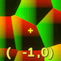
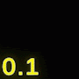
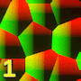
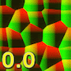
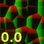
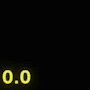

# Cellular Curl Noise

菜单路径：**Operator > Noise > Cellular Curl Noise**

**Cellular Curl Noise** 运算符允许您根据提供的坐标，在一维、二维或三维的指定范围内对噪声值进行采样。Cellular Curl Noise 使用与 [Cellular Noise](Operator-Cellular-Noise.md) 运算符类似的数学计算，但增加了一个卷曲功能，可以产生湍流噪声。这种噪声是不可压缩的（无散度），这意味着粒子无法收敛到它们卡住的下沉点。

Curl Noise 的一个很好的用例是模拟流体或气体，而无需执行复杂的计算。

## 运算符设置

| **属性** | **类型** | **描述** |
| --- | --- | --- |
| **Dimensions** | Enum | 指定噪声是二维还是三维。 |
| **类型** | Enum | 指定要使用何种类型的噪声。 |

## 运算符属性

| **输入** | **类型** | **描述** |
| --- | --- | --- |
| **Coordinate** | Float   Vector2   Vector3 | 要从中采样的噪声场中的坐标。     **Type** 会更改以匹配 **Dimensions** 数量。 |
| **Frequency** | Float | Unity 采样噪声的周期。频率越高，导致噪声更改越频繁。    |
| **Octaves** | Int | 噪声的层数。八度音阶越多，创建的外观越具多样性，但计算也更加耗费资源。    |
| **Roughness** | Float | Unity 应用到每个八度音程的比例因子。Unity 仅在 **Octaves** 设置为大于 1 的值时才使用粗糙度。    |
| **Lacunarity** | Float | 每个连续八度音程的频率变化率。Lacunarity 值为 1 会导致每个八度音程具有相同的频率。    |
| **Amplitude** | Float | 噪音的量级。较高的值会增加 **Noise** 端口可以返回的值的范围。    |

| **输出** | **类型** | **描述** |
| --- | --- | --- |
| **Noise** | Float | 您指定的坐标处的噪声值。 |
