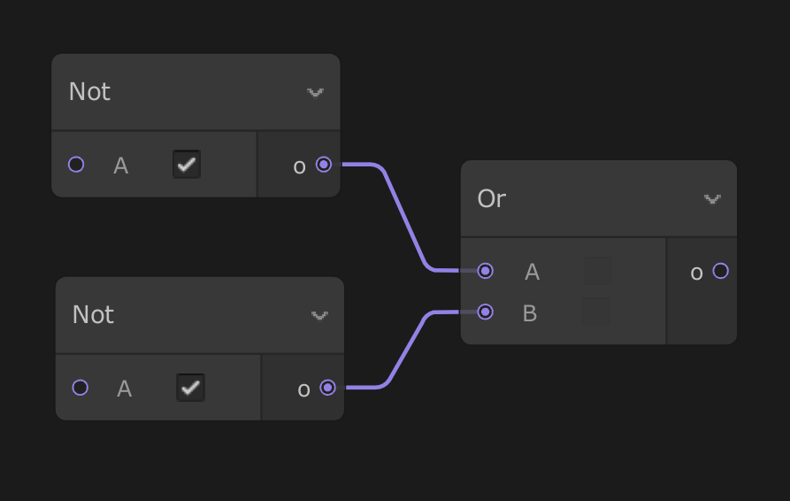

# Nor（逻辑）

菜单路径：**Operator > Logic > Nor**

**Nor** 运算符接受两个输入并输出两者的逻辑 *Nor* 运算结果。*Nor* 是一项复合运算，首先计算输入的 *not* 结果，然后计算该结果的 *or* 运算。如果 A 或 B 中有任何一个为`false`，则 A **Nor** B 结果为`true`。此运算符等效于 C#`!`运算符后跟`||`运算符。

## 运算符属性

| **输入** | **类型** | **描述** |
| --- | --- | --- |
| **A** | bool | 左操作数。如果此值为`false`，则 **o** 为`true`。 |
| **B** | bool | 右操作数。如果此值为`false`，则 **o** 为`true`。 |

| **输出** | **类型** | **描述** |
| --- | --- | --- |
| **o** | bool | 如果 **A** 或 **B** 为`false`，则此值为`true`。否则，如果 **A** 和 **B** 均为`true`，此值为`false`。 |

## Details

此运算符提供与下图相同的结果：

