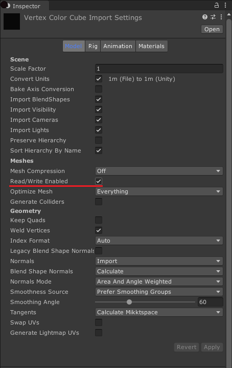

<b>实验性:</b> 此功能目前处于试验阶段，在以后的主要版本中可能会发生更改。

# Mesh Index Count

**菜单路径 : Operator > Sampling > Mesh Index Count**

**菜单路径 : Operator > Sampling > Skinned Mesh Index Count**

Mesh Index Count 运算符允许您检索网格或蒙皮网格渲染器几何体中的索引数。

## 运算符设置

| **属性** | **类型** | **描述**                                              |
| ------------ | -------- | ------------------------------------------------------------ |
| **Source**   | Enum     | **(检查器)** 指定要从中采样的几何体类型。选项包括: &#8226; **Mesh**: 网格资产中的样本。 &#8226; **Skinned Mesh Renderer**: 来自 [蒙皮网格渲染器](https://docs.unity3d.com/Manual/class-SkinnedMeshRenderer.html) 的示例。 |

### 运算符属性

| **Input**                 | **类型**              | **描述**                                              |
| ------------------------- | --------------------- | ------------------------------------------------------------ |
| **Mesh**                  | Mesh                  | 要采样的源网格资源。 仅当将 **Source** 设置为 **Mesh** 时，才会显示此属性。 |
| **Skinned Mesh Renderer** | Skinned Mesh Renderer | 要采样的源 Skinned Mesh Renderer （蒙皮网格渲染器） 组件。这是对场景中组件的引用。要将蒙皮网格渲染器分配给此端口，请在 [Blackboard](Blackboard.md) 中创建蒙皮网格渲染器属性并公开该属性。 仅当将 **Source** 设置为 **Skinned Mesh Renderer** 时，才会显示此属性。 |

| **Output** | **类型** | **描述**                                              |
| ---------- | -------- | ------------------------------------------------------------ |
| **Count**  | UInt     | 几何图形中的索引数。如果拓扑使用默认三角形列表，则可以将此值除以 3 以获得三角形的数量。 |

#### 局限性

Mesh Index Count 运算符具有以下限制:

- 如果 Mesh 是不可 [读](https://docs.unity3d.com/ScriptReference/Mesh-isReadable.html)的, 则此 Operator 返回 uint。MaxValue 的 API 值。有关如何使网格可读的信息，请参阅 [Model import settings](https://docs.unity3d.com/Manual/FBXImporter-Model.html)。

