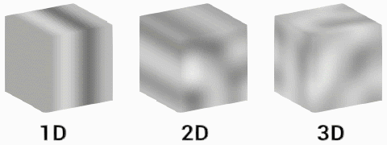
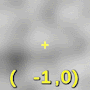
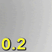
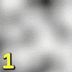
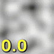
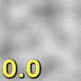
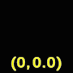

# Perlin Noise

菜单路径：**Operator > Noise > Perlin Noise**

**Perlin Noise** 运算符允许您指定坐标以在一维、二维或三维的指定范围内对噪声值进行采样。Perlin 噪声是一种梯度噪声，它具有良好的值分布，这使得具有相似相邻值的情况更加罕见。

您可以使用此运算符为您的粒子属性引入多样性。一个常见的用例是使用每个粒子的位置作为坐标，来对噪声进行采样以输出新的颜色、速度或位置值。

## 运算符设置

| **属性** | **类型** | **描述** |
| --- | --- | --- |
| **Dimensions** | Enum | 指定噪声是一维、二维还是三维。 |
| **类型** | Enum | 指定要使用何种类型的噪声。 |

## 运算符属性

| **输入** | **类型** | **描述** |
| --- | --- | --- |
| **Coordinate** | Float Vector2 Vector3 | 噪声场中要从中采样的坐标。   **Type** 会更改以匹配 **Dimensions** 的数量。 |
| **Frequency** | Float | Unity 采样噪声的周期。频率越高，导致噪声更改越频繁。    |
| **Octaves** | Int | 噪声的层数。八度音阶越多，创建的外观越具多样性，但计算也更加耗费资源。   |
| **Roughness** | Float | Unity 应用到每个八度音程的比例因子。Unity 仅在 **Octaves** 设置为大于 1 的值时才使用粗糙度。  |
| **Lacunarity** | Float | 每个连续八度音程的频率变化率。Lacunarity 值为 1 会导致每个八度音程具有相同的频率。   |
| **Range** | Vector2 | Unity 计算噪声的范围。噪声保持在您在此处指定的 X 和 Y 值之间，其中 X 是最小值，Y 是最大值。    |

| **输出** | **类型** | **描述** |
| --- | --- | --- |
| **Noise** | Float | 您指定的坐标处的噪声值。 |
| **Derivatives** | Float   Vector2 Vector3 | 每个维度的噪声变化率。   **Type** 会更改以匹配 **Dimensions** 的数量。 |

