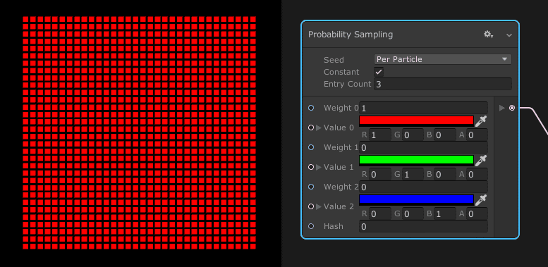

# Probability Sampling

菜单路径：**Operator > Logic > Probability Sampling**

**Probability Sampling** 运算符执行一种 switch/case 运算，其中由权重控制选择 case 的概率。如果所有权重都相等，则此运算符会生成不同输出值的均匀分布。



## 运算符设置

| **设置** | **描述** |
| --- | --- |
| **Integrated Random** | （**检查器**）指定此运算符是自己生成随机数，还是允许您输入自定义随机数。 |
| **Seed** | 定义随机数的范围。有关更多信息，请参阅[随机数](Operator-RandomNumber.md#oprerator-settings)。  <br/>此设置仅在您启用 **Integrated Random** 时显示。 |
| **Constant** | 指定生成的随机数是否为常数。有关更多信息，请参阅[随机数](Operator-RandomNumber.md#oprerator-settings)。  <br/>此设置仅在您启用 **Integrated Random** 时显示。 |
| **Entry Count** | 要测试的 case 的数量。最大值为 **32**。 |

## 运算符属性

| **输入** | **类型** | **描述** |
| --- | --- | --- |
| **Weight 0** | float | 第一个值的权重。该值与其余权重相比越大，运算符选择第一个值的机会就越大。 |
| **Value 0** | [Configurable](#运算符配置) | 在运算符选择 **Weight 0** 时要输出的值。 |
| **Weight 1** | float | 第二个值的权重。该值与其余权重相比越大，运算符选择第二个值的机会就越大。 |
| **Value 1** | [Configurable](#运算符配置) | 在运算符选择 **Weight 1** 时要输出的值。 |
| **Weight N** | float | 要公开更多案件，请增加 **Entry Count**。 |
| **Value N** | [Configurable](#运算符配置) | 要公开更多案件，请增加 **Entry Count**。 |
| **Rand** | float | 此运算符用于从权重中选择值的值。此值应介于 **0** 和 **1** 之间。此属性仅在您禁用 **Integrated Random** 时显示。 |
| **Hash** | uint | 此运算符用于创建常熟随机值的值。此属性仅在启用 **Constant** 时才显示。 |

| **输出** | **类型** | **描述** |
| --- | --- | --- |
| **输出** | [Configurable](#运算符配置) | 对应 case 条目等于 **Input** 值时的值，或者，如果没有任何匹配，则为 **Default**。 |

## 运算符配置

要查看该节点的配置，请单击节点标题上的**齿轮**图标。

| **属性** | **描述** |
| --- | --- |
| **类型** | 此运算符使用的值类型。有关此属性支持的类型的列表，请参阅[可用类型](#可用类型)。 |

### 可用类型

您可以将以下类型用于**输入值**和**输出**端口：

+   **Bool**
+   **Int**
+   **Uint**
+   **Float**
+   **Vector2**
+   **Vector3**
+   **Vector4**
+   **Gradient**
+   **AnimationCurve**
+   **Matrix**
+   **OrientedBox**
+   **Color**
+   **Direction**
+   **Position**
+   **Vector**
+   **Transform**
+   **Circle**
+   **ArcCircle**
+   **Sphere**
+   **ArcSphere**
+   **AABox**
+   **Plane**
+   **Cylinder**
+   **Cone**
+   **ArcCone**
+   **Torus**
+   **ArcTorus**
+   **Line**
+   **Flipbook**
+   **Camera**

此列表不包含与缓冲区或纹理对应的任何类型，因为无法在生成的 HLSL 代码中将这些类型指定为局部变量。

## Details

此运算符的内部算法可以通过以下示例代码来描述：

```
//Input

float[] weight = { 0.2f, 1.2f, 0.7f };

char[] values = { 'a', 'b', 'c' };

//计算前缀高度和

float[] prefixSumOfWeight = new float[height.Length];

prefixSumOfHeight[0] = weight[0];

for (int i = 1; i < weight.Length; ++i)

    prefixSumOfHeight[i] = weight[i] + weight[i - 1];

//选取一个随机值 [0, sum of all height]

var rand = Random.Range(0.0f, weight[weight.Length - 1]);

//Evaluate probability sampling

char r = 'z';

for (int i = 0; i < weight.Length; ++i)

{

    if (rand < prefixSumOfWeight[i] || i == weight.Length - 1)

    {

        r = values[i];

        break;

    }

}

//Output

Debug.Log("Result : " + r.ToString());
```
