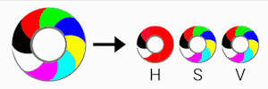

# RGB to HSV

菜单路径：**Operator > Color > RGB to HSV**

此运算符将 RGB（红色、绿色、蓝色）颜色值转换为 HSV（色相、饱和度、值）颜色值。

如果您想构建新颜色或有选择地更改输入颜色的某些方面，则此运算符很有用。例如，要执行后者，您可以使用此运算符将 RGB 颜色更改为 HSV，更改色调（纯光谱颜色）、饱和度（强度）或值（颜色的亮度），然后使用 [HSV to RGB](Operator-HSVToRGB.md) 运算符将其转换回 RBG 颜色。

备注：颜色运算符在每个粒子级别上工作。要在每像素级别重新着色粒子的纹理，请使用系统输出上下文中的 **Color Mapping**，或者通过 [Shader Graph](https://docs.unity.cn/cn/Packages-cn/com.unity.shadergraph@latest/index.html) 创建自己的着色器。

## 运算符属性

| **输入** | **类型** | **描述** |
| --- | --- | --- |
| **Color** | Color | 要转换为 HSV 颜色的 RGB 值。 |

| **输出** | **类型** | **描述** |
| --- | --- | --- |
| **HSV** | Color | 从输入 RGB 值转换成的 HSV 颜色。 |
