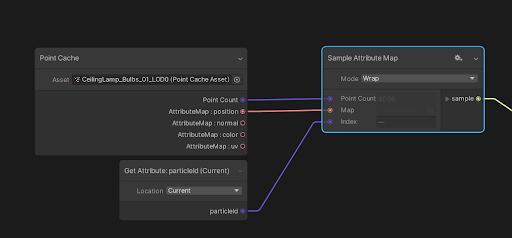

# Attribute Map

 **Menu Path : Operator > Sampling > Attribute Map**

使用“采样属性映射”操作符可以从[点缓存](point-cache-in-vfx-graph.md)中采样[属性映射](point-cache-in-vfx-graph.md#attribute-map)。

此操作符接受属性映射和索引，并输出索引处的属性值。此操作符还获取点缓存中的点数。**警告**：此操作符需要点数才能工作。如果未输入点数或输入不正确的值，则此操作符不会正确地对属性贴图进行采样。

根据属性贴图，输出属性值类型会发生变化。必须显式指定此运算符的输出类型，否则会产生未定义的行为。有关如何执行此操作的信息，请参阅[运算符配置](#operator-configuration)。

 

### 运算符设置

| **Input** | **描述**|
| --------- | ------------------------------------------------------------ |
| **Mode**  |的值**索引**超出范围时使用的换行模式**地图**。选项包括： •**夹钳**：钳制的**地图**第一个和最后一个索引之间的索引。 •**包裹**：将索引回绕到的**地图**另一侧。 •**镜子**：镜像顶点列表，以便超出范围的索引在中**地图**来回移动。|

### 运算符属性

| **Input**       | **Type**  | **描述**|
| --------------- | --------- | ------------------------------------------------------------ |
| **Point Count** | uint      |点缓存中存在的点数|
| **Map**         | Texture2D |包含点缓存字段的属性映射。例如，每个点的位置。|
| **Index**       | uint      |要采样的点的索引。|

| **Output** | **Type**                                | **描述**|
| ---------- | --------------------------------------- | ------------------------------------------------------------ |
| **Sample** | [Configurable](#operator-configuration) |由输入索引指定的点的属性映射的内容。  **警告**注意：必须显式指定此特性的**类型**，以便它与存储在属性映射中的类型匹配。有关如何执行此操作的信息，请参阅[运算符配置](#operator-configuration)。|

## 运算符配置

要查看该运算符的配置，请单击运算符标题中的COG图标。可以从中[可用类型](#available-types)选择输出的类型。

### 可用类型

你可以为输入端口使用以下类型：
  
-  **float**
-  **int**
-  **uint**
-  **bool**
-  **Vector2**
-  **Vector3**
-  **Vector4**