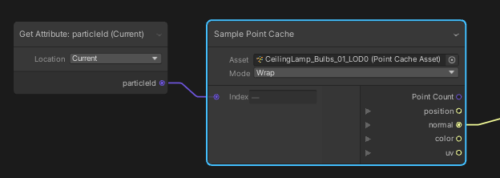

# Sample Point Cache

 **Menu Path : Operator > Sampling > Sample Point Cache**

“Sample Point Cache”操作符使你能够采样[点缓存](point-cache-in-vfx-graph.md)。

该操作符接受一个[点缓存资源](point-cache-asset.md)和一个索引，然后输出索引处每个点属性的值。它还输出点缓存中的点数。输出属性值可以是各种类型，具体取决于它们存储的数据。

 

### 运算符设置

| **Setting** | **描述**|
| ----------- | ------------------------------------------------------------ |
| **Asset**   |要从中进行采样的点缓存资源。|
| **Mode**    |的值**索引**超出点缓存**资产**的范围时要使用的换行模式。选项包括： •**夹钳**：钳制的**地图**第一个和最后一个索引之间的索引。 •**包裹**：将索引回绕到的**地图**另一侧。 •**镜子**：镜像顶点列表，以便超出范围的索引在中**地图**来回移动。|

### 运算符属性

| **Input** | **Type** | **描述**|
| --------- | -------- | --------------------------------- |
| **Index** | uint     |要采样的点的索引。|

| **Output**       | **Type**  | **描述**|
| ---------------- | --------- | ------------------------------------------------------------ |
| **Point Count**  | uint      |点缓存中存在的点数|
| **\<attribute>** | Dependent |由输入索引指定的点处的每个属性映射的内容。  **注意**：**类型**根据属性映射存储的数据而变化。|
