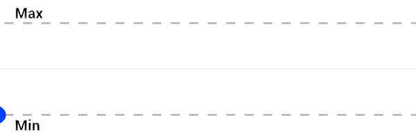

# Sine Wave

菜单路径： **Operator > Math > Wave > Sine Wave**

 **Sine Wave**运算符评估输入以产生在最小值和最大值之间平滑振荡的值。该算子还包括改变输出值振荡速率的频率值。

 

如果将 **Frequency** 设置为 **1**，则当 **Input** 从 **0** 变为 **1** 时，输出值将从 **Min** 变为 **Max**，然后再回到 Min。

可以使用该操作符在任意两个值之间平滑移动，例如，上下移动粒子。如果将设置**Min**为**0**和**Max**设置为**1**，则可以将其与[Lerp](Operator-Lerp.md)操作符一起使用，以在任意两个值（如位置或颜色）之间进行插值。

## 运算符属性

| **Input**     | **Type**                                | **描述**|
| ------------- | --------------------------------------- | ------------------------------------------------------------ |
| **Input**     | [Configurable](#operator-configuration) |此运算符计算以生成输出值的值。|
| **Frequency** | [Configurable](#operator-configuration) | **Input**值在和**Max**之间移动**Min**的速率。值越大，波的重复次数越多。|
| **Min**       | [Configurable](#operator-configuration) |Out 可以是的最小值。|
| **Max**       | [Configurable](#operator-configuration) |Out 可以是的最大值。|

| **Output** | **Type**          | **描述**|
| ---------- | ----------------- | ------------------------------------------------------------ |
| **Out**    | Matches **Input** |此运算符基于**投入**和**频率**在和**麦克斯**之间生成**分钟**的值。|

## 运算符配置

要查看运算符的配置，请单击**齿轮**运算符标题中的图标。

| **Property**  | **描述**|
| ------------- | ------------------------------------------------------------ |
| **Input**     | **Input**端口的值类型。有关此属性支持的类型的列表，请参见[可用类型](#available-types)。|
| **Frequency** | **Frequency**端口的值类型。有关此属性支持的类型的列表，请参见[可用类型](#available-types)。|
| **Min**       | **Min**端口的值类型。有关此属性支持的类型的列表，请参见[可用类型](#available-types)。|
| **Max**       | **Max**端口的值类型。有关此属性支持的类型的列表，请参见[可用类型](#available-types)。|

### 可用类型

你可以将以下类型用于**Input**、**Min**和端口**Max**：

-  **float**
-  **Vector**
-  **Vector2**
-  **Vector3**
-  **Vector4**
-  **Position**
-  **Direction**