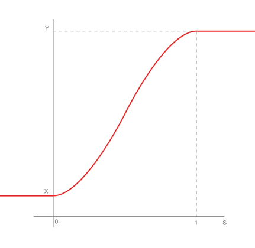

# Smoothstep

菜单路径： **Operator > Math > Arithmetic > Smoothstep**

 **Smoothstep**运算符计算两个边界值之间的值的线性插值，并在限制处进行平滑。

此运算符返回一个介于和**是的**之间的值**X**。如果此值介于**X**和**是的**之间，则取决于的**S**值：

- 如果**S**大于1，则结果为**是的**。
- 如果**S**小于0，则结果为 **X.**

- 如果**S**介于0和1之间，则结果是和**是的**之间**X**的平滑过渡。结果= (y-X) * (3s2 - 2s3) + **X**

此操作符接受各种类型的输入值。有关此运算符可以使用的类型的列表，请参见[可用类型](#available-types)。**X**和**是的**输入始终为同一类型。**S**更改为与**X**和**是的**相同的类型。

 

## 运算符属性

| **Input** | **Type**                                | **描述**|
| --------- | --------------------------------------- | ------------------------------------------------------------ |
| **X**     | [Configurable](#operator-configuration) |要插值的值。|
| **Y**     | [Configurable](#operator-configuration) |要插值的值。|
| **S**     | [Configurable](#operator-configuration) |插值的值。浮点类型或与**X**相同类型的输入。|

| **Output** | **Type**    | **描述**|
| ---------- | ----------- | ------------------------------------------------------------ |
| **Out**    | Output Port |在和**是的**之间**X**进行线性插值**S**，并在限制处  **类型**进行平滑。更改以匹配和**是的**的**X**类型。|

## 运算符配置

要查看**Smoothstep**运算符的配置，请单击**齿轮**运算符标题中的图标。中[可用类型](#available-types)的类型 **X****是的**必须相同。如果**S**是向量类型，则Unity按值计算插值。

### 可用类型

你可以为**输入**端口使用以下类型：

-  **float**
-  **Vector**
-  **Vector2**
-  **Vector3**
-  **Vector4**
-  **Position**
-  **Direction**