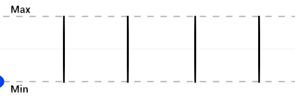

#  Square Wave

菜单路径： **Operator > Math > Wave > Square Wave**

 Square Wave操作符允许你生成一个值，该值根据提供的输入和设置的频率以稳定的间隔在最小值和最大值之间交替。

 

如果 **Frequency** 设置为 **1**，则蓝点保持在 **Min** 处，其 **Input** （输入） 值从 0 到接近 0.5。然后，如果 **Input** （输入） 值从 0.5 到接近 1，则点保持为 **Max**（最大值）。之后，挥手重复。

你可以使用此运算符以稳定的速率在两个值之间即时切换。如果要定期打开和关闭行为，这将非常有用。例如，如果要以稳定的时间间隔施加力。

## 运算符属性

| **Input**     | **Type**                                | **描述**|
| ------------- | --------------------------------------- | ------------------------------------------------------------ |
| **Input**     | [Configurable](#operator-configuration)     |此运算符计算以生成输出值的值。|
| **Frequency** | [Configurable](#operator-configuration)     | **Input** 值在 **Min** 和 **Max** 之间切换的速率。较大的值会使波形重复得更多。|
| **Min**       | [Configurable](#operator-configuration)     |Out 可以是的最小值。|
| **Max**       | [Configurable](#operator-configuration) |Out 可以是的最大值。|

| **Output** | **Type**          | **描述**|
| ---------- | ----------------- | ------------------------------------------------------------ |
| **Out**    | Matches **Input** | 此 Operator 根据 **Input** 和 **Frequency** 在 **Min** 和 **Max** 之间生成的值。。|

## 运算符配置

要查看运算符的配置，请单击**齿轮**运算符标题中的图标。

| **Property**  | **描述**|
| ------------- | ------------------------------------------------------------ |
| **Input**     | **Input**端口的值类型。有关此属性支持的类型的列表，请参见[可用类型](#available-types)。|
| **Frequency** | **Frequency**端口的值类型。有关此属性支持的类型的列表，请参见[可用类型](#available-types)。|
| **Min**       | **Min**端口的值类型。有关此属性支持的类型的列表，请参见[可用类型](#available-types)。|
| **Max**       | **Max**端口的值类型。有关此属性支持的类型的列表，请参见[可用类型](#available-types)。|

### 可用类型

你可以将以下类型用于**Input**、**Min**和端口**Max**：

-  **float**
-  **Vector**
-  **Vector2**
-  **Vector3**
-  **Vector4**
-  **Position**
-  **Direction**