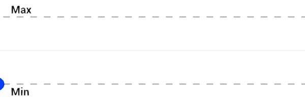

# Triangle Wave

菜单路径： **Operator > Math > Wave > Triangle Wave**

 **Triangle Wave**操作符允许你根据提供的输入和设置的频率，生成在最小值和最大值之间线性振荡的值。

 

如果 **Frequency** 设置为 **1**，则在 **Input** 从 0 到 1 的范围内，蓝点从 **Min** 到 **Max**，再回到 **Min** 呈一条直线。

可以使用此操作符直接在任意两个值之间移动，例如，向上和向下移动粒子。如果将 **Min** 设置为 **0** 且 **Max** 设置为 **1**，则可以将其与[Lerp](Operator-Lerp.md)操作符一起使用，以在任意两个值（如位置或颜色）之间进行插值。

## 运算符属性

| **Input**     | **Type**                                | **描述**|
| ------------- | --------------------------------------- | ------------------------------------------------------------ |
| **Input**     | [Configurable](#operator-configuration)   |此运算符计算以生成输出值的值。|
| **Frequency** | [Configurable](#operator-configuration)    | **Input** 值在 **Min** 和 **Max** 之间移动的速率。较大的值会使波形重复得更多。|
| **Min**       | [Configurable](#operator-configuration)     |Out 可以是的最小值。|
| **Max**       | [Configurable](#operator-configuration) |Out 可以是的最大值。|

| **Output** | **Type**          | **描述**|
| ---------- | ----------------- | ------------------------------------------------------------ |
| **Out**    | Matches **Input** | 此 Operator 根据 **Input** 和 **Frequency** 在 **Min** 和 **Max** 之间生成的值。|

## 运算符配置

要查看运算符的配置，请单击**齿轮**运算符标题中的图标。

| **Property**  | **描述**|
| ------------- | ------------------------------------------------------------ |
| **Input**     | **Input**端口的值类型。有关此属性支持的类型的列表，请参见[可用类型](#available-types)。|
| **Frequency** | **Frequency**端口的值类型。有关此属性支持的类型的列表，请参见[可用类型](#available-types)。|
| **Min**       | **Min**端口的值类型。有关此属性支持的类型的列表，请参见[可用类型](#available-types)。|
| **Max**       | **Max**端口的值类型。有关此属性支持的类型的列表，请参见[可用类型](#available-types)。|

### 可用类型

你可以将以下类型用于**Input**、**Min**和端口**Max**：

-  **float**
-  **Vector**
-  **Vector2**
-  **Vector3**
-  **Vector4**
-  **Position**
-  **Direction**