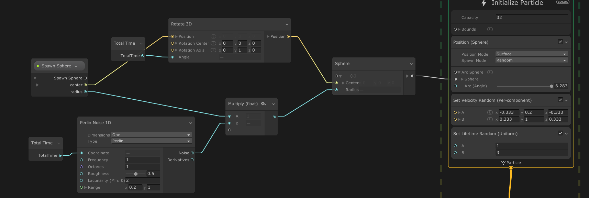
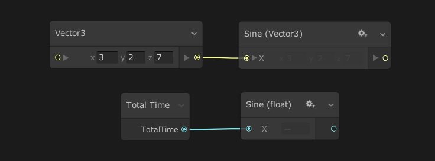
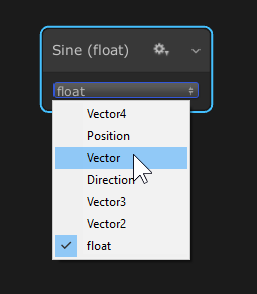
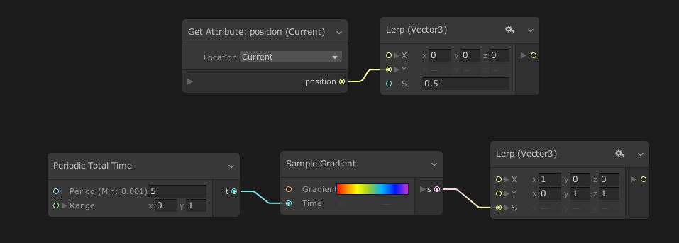
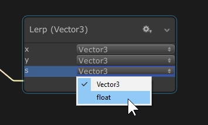
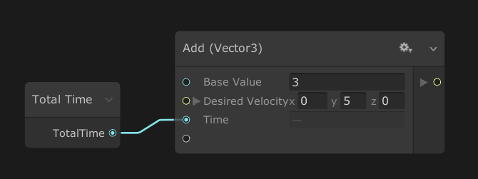
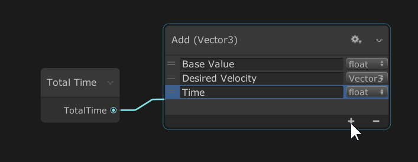

# Operators 运算符

运算符是 [Property Workflow](GraphLogicAndPhilosophy.md#property-workflow-horizontal-logic) 的原子元素。这些节点允许您在 Visual Effect Graph 中定义自定义表达式，以用于创建自定义行为。例如，通过数学运算计算值，并使用这些运算的结果对曲线、梯度进行采样，以将结果值用于 [Block](Blocks.md) 或 [Context](Contexts.md)， [Properties](Properties.md).

## 添加 Operator 节点

您可以通过以下方式添加 Operator 节点：

* 在 Create Node 菜单中:
  * 右键单击空白区域，然后从菜单中选择 **Create Node**。
  * 右键单击边，然后从菜单中选择 **Create Node**。
  * 当光标位于空白区域时，按空格键。
  * 从 Property 中拖动 Edge Connection，然后在空白处释放。
* 复制节点:
  * 在 Context menu（上下文菜单）中选择 **Duplicate**（复制）（或 Ctrl+D）。
  * 从上下文菜单**复制、剪切**和**粘贴**操作符（或 Ctrl+C/Ctrl+X，然后按 Ctrl+V）

## 配置 Operator

当您在 Node UI 或 Inspector 中更改 Operator [设置](GraphLogicAndPhilosophy.md#settings) 时，Operator 会更改其外观和行为方式。

例如，当您将`Position (Depth)`运算符的 Cull Mode 从**None**更改为**Range**时，Unity会为操作员添加一个额外的**Depth Range**属性。

## Uniform Operators

Uniform Operators 是可与 Variable Type 的单个输入一起使用的节点。例如，您可以对 float、Vector3 或 Integer 使用绝对值。

任何 Uniform 运算符的输出类型始终与其输入 Type 相同。连接具有不同类型的新输入将自动更改运算符的输出类型。如果要手动将 Node 设置为特定类型，请参阅[配置 Uniform Operators](#配置-uniform-operators)。

##### 配置 uniform Operators

按右上角的 Options 图标，将 Node 视图切换到 Configuration 模式。在此模式下，您可以手动更改运算符 Type。

## Unified Operators

除了 Uniform Operators 之外，一些具有许多输入的运算符还可以处理 **Variable Types 的多个输入**。这些节点称为 **Unified Operator**。

例如，**Lerp** 运算符可以基于浮点数在两个 Vector 之间均匀插值，或者使用相同长度的 Vector 在每个组件之间进行插值。

Unified Operators 具有类型约束，但允许一些灵活性，以适应某些类型的类型。

#### 配置 Unified Operators

按右上角的 Options 图标，将 Node 视图切换到 Configuration 模式。在此模式下，您可以手动更改每个输入的运算符 Types。在某些情况下，更改一种输入类型将更改另一种输入类型，以保持兼容性。

## Cascaded Operators

**Cascaded Operators** 处理可变输入计数。这些 Operator 可以处理许多 output 并处理不同的 input Type，例如 **Unified Operators**。

例如，Add Node 允许您使用单个 Node 添加许多不同类型的输入。

您可以将许多输入连接到 Cascaded Operator。要向列表中添加新项目，请将边缘连接到 Nod 底部的最后一个灰色输入。这将创建一个使用您连接的属性类型的新输入。

删除连接时，Unity 还会从列表中删除 input 属性。但是，您也可以使用 Configuration Mode 手动删除 input 属性。

#### 配置 Cascaded Operators

按右上角的 Options 图标，将 Node 视图切换到 Configuration mod。在此模式下，您可以：

+ 使用其文本字段重命名输入。
+ 使用类型 Popup 更改输入类型。
+ 通过拖动每个输入行左侧的 Handle 对 Inputs 重新排序。
+ 使用 ''+'' 按钮手动添加输入。
+ 使用 ''-'' 按钮删除所选输入。