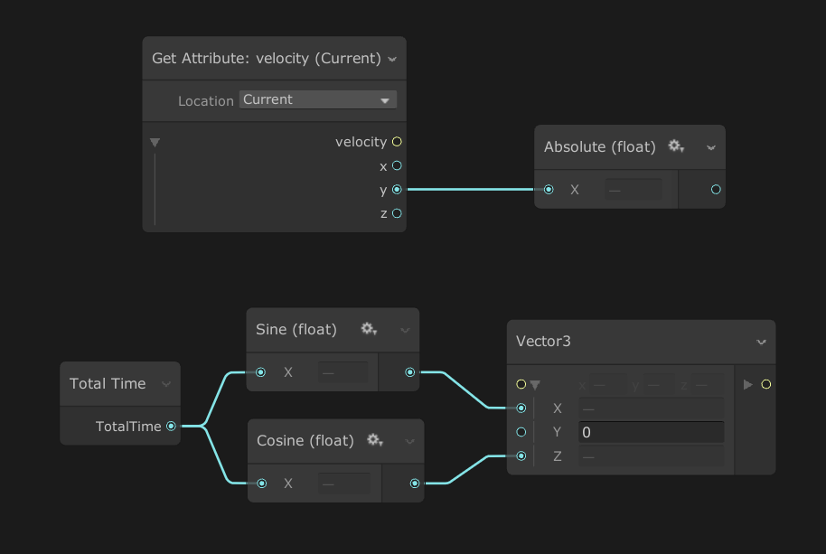
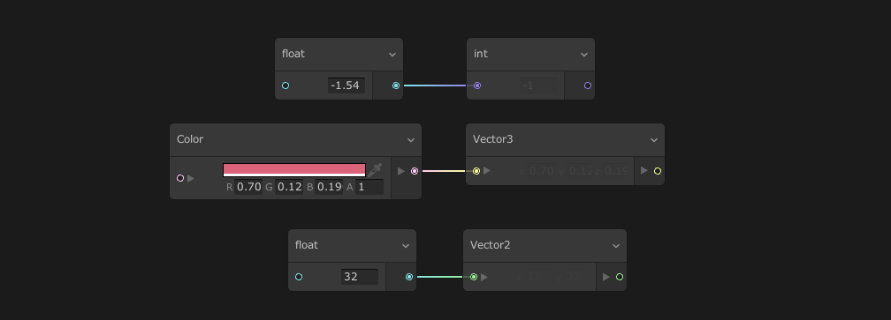
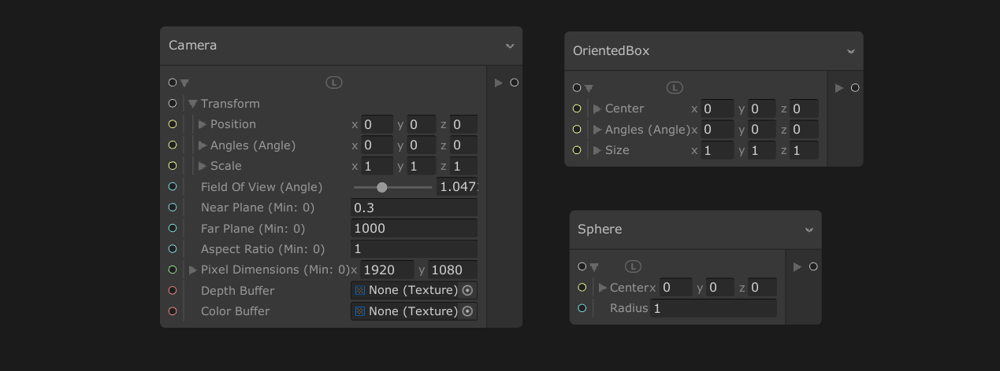

# Properties 属性

属性是可编辑的字段，您可以使用[属性工作流程](graphlogicicandphilosophy.md)连接到graph元素。它们可以在graph元素上找到，例如[contexts](contexts.md)，[blocks](blocks.md)和[operators](operators.md)。

## 使用 Properties

属性显示在graph元素上，并将根据它们在graph中的实际值相应地更改其值 ：将另一个属性连接到属性槽将显示已连接属性的计算值。

断开已连接属性的连接后，该字段将恢复为之前设置的属性值。

## Property 类型

Visual Effect Graph 中的属性可以是任何类型，包括：

* boolean
* integer
* float
* Vectors
* Textures
* AnimationCurve
* Gradient

### 访问 Property 组件

由多个组件组成的属性（例如 Vectors 或 Colors）可以单独显示每个组件，以便将这些组件连接到兼容类型的其他属性。使用属性旁边的箭头展开组件。

### 转换 Properties

属性可以在基类型之间连接以执行转换。转换会更改您正在处理的数据类型，以便继承其属性。例如，如果将 float 转换为 integer，则 float 可以使用整数除法。

从一种类型转换为另一种类型遵循以下规则：

+ HLSL 中的所有 Casting 规则都适用：
  + 无法强制转换的 Boolean 类型除外。
  + 标量将通过设置所有分量来转换为 vector。
+ 通过仅采用前 N 个分量，将 vector 强制转换为较小大小的 vector。

### 复合 Property 类型

复合属性类型由基本数据类型组成。这些类型描述更复杂的数据结构。例如，Sphere 由位置 （Vector3） 和半径 （float） 组成。

展开 Compound Property Types 以访问其组件。

### Spaceable Properties

Spaceable Properties 是携带 **Space 信息** （Local/World） 及其值的属性类型。graph在需要时使用此信息执行自动空间转换。

单击 Property Field 左侧的 Space Modifier 以更改它。

例如，Position 类型带有 Vector3 值和 Spaceable 属性。如果将 Spaceable Property 设置为 Local [0,1,0]，则表示我们引用的是本地空间中的 0,1,0 值。

根据 [System Simulation Space](Systems.md#system-spaces)，该值将在需要时自动转换为仿真空间。

> 提示: 您可以使用 Change Space 运算符手动更改属性空间。

## Property 节点

属性节点是允许访问 [Blackboard](Blackboard.md) 中定义的graph范围属性的 [Operators](Operators.md)。这些属性允许您在整个graph的不同位置重复使用相同的值。

+ 如果属性已公开，则 Property Nodes 会在 Property name （属性名称） 后面显示一个绿点。
+ 要创建 Property 节点：
  + 将 Node 从 Blackboard Panel 拖动到工作区中。
  + 打开 右键单击 上下文菜单，打开 **Create Node** 菜单，然后从 属性 类别中选择所需的属性。
+ 要将属性节点转换为相同类型的内联节点，请右键单击属性节点，然后选择 **Convert to Inline**
+ 从 Blackboard 中删除属性时，Unity 还会从graph中删除其属性 Node 实例。

