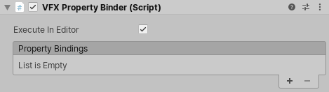

# 属性绑定器

Property Binders 是可以附加到具有 [Visual Effect 组件](VisualEffectComponent.md) 的游戏对象的 C# 行为。使用这些行为可在 scene 或 gameplay 值与此 Visual Effect 实例的 [Exposed Properties](Blackboard.md#exposed-properties-in-inspector) 之间建立连接。

例如，Sphere Binder 可以使用场景中链接的球体碰撞器的值自动设置 Sphere Exposed Property 的位置和半径。

## 添加属性绑定器



您可以通过称为 **VFX Property Binder** 的常见 MonoBehaviour 添加 Property Binder。此行为允许您使用一个或多个 **Property Bindings**。每个属性绑定都会在 [Exposed Property](Blackboard.md#exposed-properties-in-inspector)  和 Runtime 或 scene 元素之间创建关系。

您还可以通过 **Add Component** 添加组件菜单添加 Property Binders。如果 VFX Property Binder 组件尚不存在，Unity 会自动创建一个组件。

## 内置属性绑定器

Visual Effect Graph 包附带以下内置属性绑定器：

* Audio
  * **Audio Spectrum to AttributeMap :** 将 Audio Spectrum 烘焙到 Attribute 映射，并将其绑定到 Texture2D 和 uint Count 属性。
* GameObject:
  * **Enabled** :将游戏对象的 Enabled 标志绑定到 bool 属性。
* Point Cache:
  * **Hierarchy to AttributeMap** : 将转换层次结构的目标位置绑定到 Texture2Ds AttributeMaps 和 uint Count。
  * **Multiple Position Binder**: 将转换列表的位置绑定到 Texture2D AttributeMap 和 uint Count。
* Input:
  * **Axis** : 将输入轴的浮点值绑定到浮点属性。
  * **Button** : 将按钮按下状态的 bool 值绑定到 bool 属性。
  * **Key** : 将键盘按键状态的 bool 值绑定到 bool 属性。
  * **Mouse** : 将鼠标的常规值（位置、速度、点击次数）绑定到公开的属性。
  * **Touch** : 将 Touch Input 的输入值（Position、Velocity）绑定到公开的属性。
* Utility:
  * **Light** : 将 Light 属性（Color、Brightness、Radius）绑定到公开的属性。
  * **Plane** : 将平面属性（位置、法线）绑定到公开的属性。
  * **Terrain** : 将地形属性（大小、高度贴图）绑定到公开的属性。
* Transform:
  * **Position**: 将游戏对象位置绑定到矢量公开属性。
  * **Position (previous)**: 将上一个游戏对象位置绑定到 vector exposed 属性。
  * **Transform**: 将游戏对象 transform 绑定到 transform 公开的属性。
  * **Velocity**: 将游戏对象速度绑定到向量公开属性。
* Physics:
  * **Raycast**: 执行物理光线投射并将其结果值（hasHit、Position、Normal）绑定到公开的属性。
* Collider:
  * **Sphere**: 将 Sphere Collider （球体碰撞体） 的属性绑定到 Sphere （球体） 公开的属性。
* UI:
  * **Dropdown**: 将 Dropdown 的索引绑定到 uint 公开的属性。
  * **Slider**: 将 float 滑块的值绑定到 uint 公开的属性。
  * **Toggle**: 将切换开关的 bool 值绑定到 bool 公开的属性。

## 编写属性绑定器

要编写属性绑定器，请在项目中添加新的C＃类，并扩展 `UnityEngine.VFX.Utility.VFXBinderBase` 类。

要扩展 `VFXBinderBase` 类，请使用以下方法之一：

* `bool IsValid(VisualEffect component)`: 一种验证可以进行绑定的方法。 VFX属性活页夹组件仅执行 `UpdateBinding()` 。如果此方法返回true。您需要在此方法中实现所有检查，以确定是否绑定。
* `void UpdateBinding(VisualEffect component)`: 如果 `IsValid` 返回true，则此方法应用绑定。

#### 示例代码

以下示例演示了一个简单的 Property Binder，它将浮点型 Property 值设置为当前游戏对象与另一个（目标）游戏对象之间的距离：

```
using UnityEngine;
using UnityEngine.VFX;
using UnityEngine.VFX.Utility;

// The VFXBinder Attribute will populate this class into the property binding's add menu.
[VFXBinder("Transform/Distance")]
// The class need to extend VFXBinderBase
public class DistanceBinder : VFXBinderBase
{
    // VFXPropertyBinding attributes enables the use of a specific
    // property drawer that populates the VisualEffect properties of a
    // certain type.
    [VFXPropertyBinding("System.Single")]
    public ExposedProperty distanceProperty;

    public Transform target;

    // The IsValid method need to perform the checks and return if the binding
    // can be achieved.
    public override bool IsValid(VisualEffect component)
    {
        return target != null && component.HasFloat(distanceProperty);
    }

    // The UpdateBinding method is the place where you perform the binding,
    // by assuming that it is valid. This method will be called only if
    // IsValid returned true.
    public override void UpdateBinding(VisualEffect component)
    {
        component.SetFloat(distanceProperty, Vector3.Distance(transform.position, target.position));
    }
}```
```
