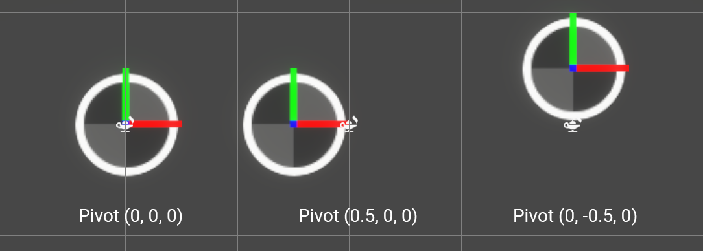
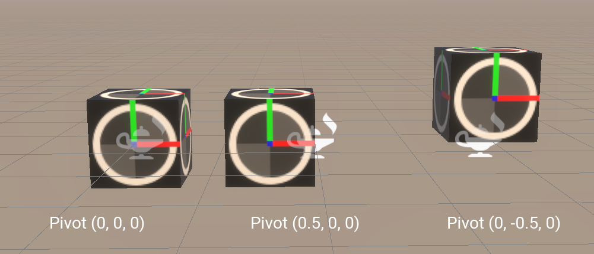

# 标准属性参考

## 标准属性
此处是所有常用属性的综合列表，以及简要说明和用法。

### 基本模拟属性

模拟属性是 Initialize 和 Update 上下文将处理的属性，以便将行为应用于**模拟元素**，例如粒子或粒子轨迹。

| 名称 | 类型 | 描述 | 默认值 |
| --- | --- | --- | --- |
| `position` | Vector3 | 模拟元素的位置，用相应的[系统空间](https://docs.unity3d.com/Systems.html)以系统单位表示 | (0,0,0) |
| `velocity` | Vector3 | 模拟元素当前的自身速度，表示为相应[系统空间](https://docs.unity3d.com/Systems.html)中的 3D 矢量，以每秒系统单位数为单位。 | (0,0,0) |
| `age` | float | 模拟元素自生成以来的年龄，以秒数为单位。 | 0.0 |
| `lifetime` | float | 模拟元素的预期寿命，以秒数为单位。 | 0.0 |
| `alive` | bool | 模拟元素是否处于存活状态。 | true |
| `size` | float | 模拟元素的大小，以系统单位为单位。 | 0.1 |

### 高级模拟属性

有些属性更高级一些，在大多数模拟中默认使用。但是，您可以更改这些属性以增强您的行为

| 名称 | 类型 | 描述 | 默认值 |
| --- | --- | --- | --- |
| `mass` | float | 粒子的质量，Kg/dm^3 | 1.0（默认为每升水 1kg） |
| `angle` | Vector3 | **Variadic:**：模拟元素的欧拉旋转，表示为度数值矢量。 | (0,0,0) |
| `angularVelocity` | Vector3 | **Variadic**：模拟元素的欧拉旋转速度，表示为每秒度数值矢量。 | (0,0,0) |
| `oldPosition` | Vector3 | **Deprecated**：如果您想在执行速度积分之前备份模拟元素的当前位置，此属性可以作为存储 Helper。 | (0,0,0) |
| `targetPosition` | Vector3 | 这个属性有多种用途：如果希望存储要到达的位置，它可以作为一个存储 Helper，然后它可以计算一个矢量以到达这个目标位置。在线渲染器中，此属性还可用于设置每个线条粒子的结束位置。 | (0,0,0) |

### 渲染属性

渲染属性并非主要用于模拟，而是用于渲染模拟元素。

| 名称 | 类型 | 描述 | 默认值 |
| --- | --- | --- | --- |
| `color` | Vector3 | 渲染元素的 R、G 和 B 分量。 | 1,1,1 |
| `alpha` | float | 渲染元素的 alpha 分量 | 1 |
| `size` | float | 渲染元素的统一大小，以系统单位为单位，应用于其**单位表示** | 0.1 |
| `scale` | Vector3 | 渲染元素的非统一缩放乘数，应用于其**单位表示** | (1,1,1) |
| `pivot` | Vector3 | 渲染元素的原点位置，用于其**单位表示** | (0,0,0) |
| `texIndex` | float | 用于为渲染元素采样 Flipbook UV 的动画帧。 | 0.0 |
| `axisX` | Vector3 | 渲染元素的计算向右轴。 | (1,0,0) |
| `axisY` | Vector3 | 渲染元素的计算向上轴。 | (0,1,0) |
| `axisZ` | Vector3 | 渲染元素的计算前向轴。 | (0,0,1) |

### 系统属性

一些其他属性可用于获取有关系统值的信息。这些属性以**只读**形式提供（您只能使用“Get”运算符使用它们）。

| 名称 | 类型 | 描述 | 默认值 |
| --- | --- | --- | --- |
| `particleID` | uint | 引用 1 个粒子的唯一 ID | 0 |
| `seed` | uint | 用于随机数计算的唯一种子。 | 0 |
| `spawnCount` | uint | SpawnEvent 属性以 Spawn 上下文中 Source Attribute 的形式提供，描述此帧生成的粒子数。 | (0,0,0) |
| `spawnTime` | float | SpawnEvent 属性以 Spawn 上下文中 Source Attribute 的形式提供，其中包含 Spawn 上下文内部时间（当使用 **Set Spawn Time** Spawn 块） | 0.0 |
| `particleIndexInStrip` | uint | Particle Strip Ring Buffer 中此元素所在位置的索引。 | 0 |

## 属性使用和隐式行为

在模拟和渲染过程中，一些属性组合适用于各种隐式用例。下面是用法列表和对它们之间关系的解释。

#### Velocity 和 Position：积分

在更新模拟期间：任何使用“velocity”属性的系统都会将速度积分到每一帧的位置。

速度积分基本上使用以下公式：“position += velocity \* deltaTime”

> 可以通过选择 Update 上下文然后将 Integration 枚举设置为 **None**，禁用自动速度积分。

#### Age、Lifetime 和 Alive

在 Initialize 上下文中为粒子设置 Lifetime 属性将隐式地将以下行为添加到 Update 上下文：

*   粒子将使用公式“age += deltaTime”老化
*   粒子将使用以下公式收获：“alive = (age < lifeTime)”

> 可以通过选择 Update 上下文然后将 Age Particles 值设置为 **False**，禁用自动粒子老化。
> 
> 可以通过选择 Update 上下文然后将 Reap Particles 值设置为 **False**，禁用自动粒子收获。
> 
> **Immortal Particles**：没有寿命周期的粒子将被视为不朽粒子。您仍然可以通过将它们的“alive”属性设置为“false”，显式杀死这样的粒子。

#### Angle 和 Angular Velocity：角积分

在更新模拟期间：任何使用“angularVelocity”属性的系统都会将角速度积分到每一帧的角度。

角速度积分基本上使用以下公式：“angle += angularVelocity \* deltaTime”

> 可以通过选择 Update 上下文然后将 Angular Integration 枚举设置为 **None**，禁用自动速度积分。

#### AxisX、AxisY 和 AxisZ

这三个属性定义了**单位表示** 3D 坐标系。虽然这些轴需要归一化，但您可以在所有三个轴之间使用非归一化长度和非正交角度。

> 大多数情况下，这些轴是使用 Orient 代码块（仅限 Output 上下文）设置的。

#### Size、Scale 和 Pivot

为了将缩放和旋转应用于模拟元素，Visual Effect Graph 使用 3 个属性：

*   `size` (float)：粒子的统一大小。
*   `scale`(Vector3)：粒子的每轴大小。
*   `pivot` (Vector3)：单位表示中的枢轴位置。

粒子的 **Pivot** 以大小为 1 的单位盒体进行计算：**单位表示**。默认情况下，它是 (0,0,0)，即盒体的中心。您可以更改其值以调整盒体的中心。每个面位于每个轴的 -0.5 或 0.5 处。

枢轴表示也可以在 3D 中进行概括，其中 Z 轴用于深度。

The pivot representation can be also generalized in 3D, with the Z Axis being used for depth.

> 使用面向摄像机的四粒子的 Z 分量会将元素拉向摄像机位置或平面，或将其推开，使其看起来位于其实际位置的更前方或更后方。

粒子的**缩放**应用两个乘数**单位表示**盒体：

*   统一“大小”
*   非统一“缩放”

您可以使用这两个属性中的任何一个来独立执行统一和非统一缩放：例如使用比例来计算初始随机比例，并使用大小属性为每个元素设置动画，保持其比例。
