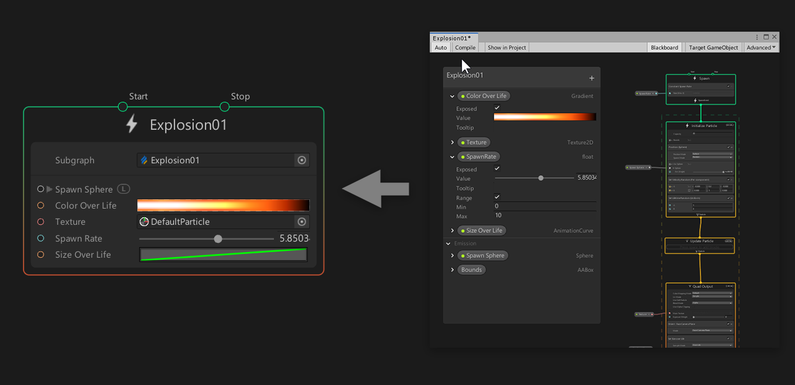
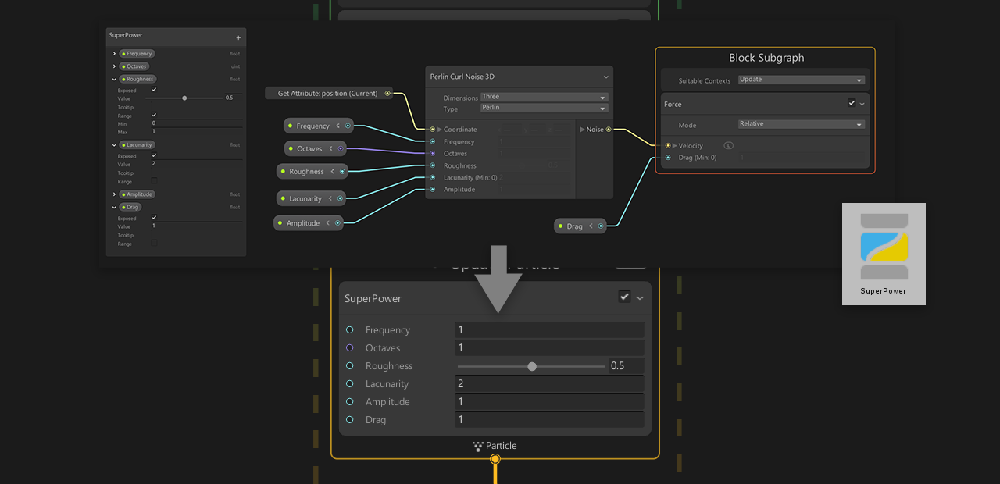
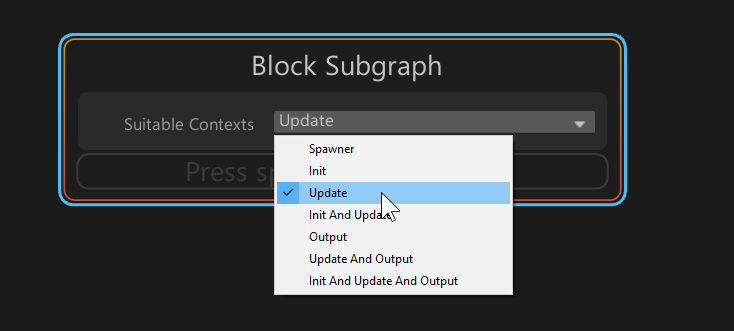
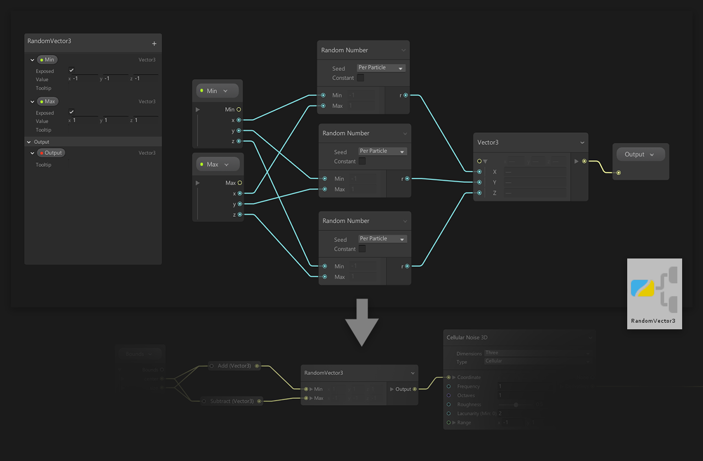

# Subgraph 子图

Visual Effect Subgraph 是一种资源，其中包含 Visual Effect Graph 的一部分，可在其他 Visual Effect Graph 或 Subgraph 中使用。子图显示为单个节点。

子图在图中可以用作三种主要用法：

- **System Subgraph**：包含在一个图中的一个或多个[系统](Systems.md) 。
- **Block Subgraph**：一组打包在一起并用作 Block 的 [Blocks](Blocks.md) 和 [Operators](Operators.md) 。
- **Operator Subgraph**：一组打包在一起并用作 Operator 的 [Operators](Operators.md)。

子图允许您将图中常用的节点集分解为可重用的资源，并将它们添加到库中。

## System Subgraphs

系统子图是**嵌套**在其他 Visual Effect Graph 中的 Visual Effect Graph：

用作 Subgraph 的 Visual Effect Graph 显示为 [Context](Contexts.md)，它显示：

* 子图中定义的 **Exposed Properties**。
* 子图中使用的 **Events**。

### 创建 System Subgraphs

要创建 System Subgraph:

1. 在 Project 窗口中创建 Visual Effect Graph。
2. 在 Visual Effect Graph 中选择一个或多个系统。
3. 导航到 右键单击 上下文菜单，然后选择 **Convert to Subgraph**.
4. 在 Save File （保存文件） 对话框中保存 Graph Asset。

使用此方法创建子图会将所有转换后的内容替换为 System Subgraph 节点。

### 编辑 System Subgraphs

要编辑在 Visual Effect Graph 窗口中打开的系统子图，请执行以下操作：

1. 双击 Project 视图中的 Visual Effect Graph 资源。
2. 右键单击 System Subgraph Context。
3. 在上下文菜单中选择 Enter Subgraph 。

### 在 Visual Effect Graph 中使用 System Subgraph

要将 System Subgraph 节点添加到图形中，请将 Visual Effect Graph 从 Project View 拖动到 Visual Effect Graph 窗口。

### 自定义 System Subgraph 节点

您可以像自定义 Visual Effect Graph 属性一样自定义 System Subgraph 属性。您还可以使用 Operators 创建自定义表达式，以扩展子图中包含的系统的行为。

您可以使用 Event 或 Spawn Context 将事件发送到 System Subgraph 节点的 Workflow 输入。

## Block Subgraphs

块子图是仅包含运算符和块的特定子图。您可以将 Block Subgraph 用作另一个 Visual Effect Graph 或 SubGraph 中的 Block。

### 创建 Block Subgraphs

要创建 Block Subgraph:

1. 在 Project 窗口中使用 **Asset/Create/Visual Effects/Visual Effect Subgraph Block** 创建一个 Visual Effect Subgraph 块。
2. 在 Visual Effect Graph 中选择一个或多个 Blocks 和可选的 Operators
3. 导航到 Right-Click 上下文菜单，然后选择 **Convert to Subgraph Block**
4. 在 Save file （保存文件） 对话框中保存 Sub Graph 资源。

使用此方法创建子图时，Unity 会将所有转换后的内容替换为 Block Subgraph 节点。

### 编辑 Block Subgraphs

您可以通过以下方式之一编辑块子图：

- 在 Visual Effect Graph 窗口中打开一个 Block Subgraph。
- 双击 Project 视图中的 Subgraph Asset。
- 右键单击子图块，然后在上下文菜单中选择 Enter Subgraph 。

您可以在名为 Block Subgraph 的不可移除上下文中添加 Blocks。

- 块子图上下文中的所有块在用作子图时按顺序执行
- 您可以使用以下 Properties 自定义 Context：
  - **Suitable Contexts** ：确定哪些上下文类型与块子图兼容

您可以定义子图块在 [Blackboard](Blackboard.md) 中显示的菜单类别

### 使用 Block Subgraphs

要将 Block Subgraph 节点添加到图形中：

- 将 Visual Effect Subgraph 块资源从 Project View 拖动到 Visual Effect Graph 窗口的上下文块区域内。

或：

- 通过键入 Block Subgraph Asset name （块子图资产名称） 来使用 Add block （添加块） 菜单。

### 自定义 Block Subgraphs

您可以像自定义常规 Block 属性一样自定义 Block Subgraph 属性。您还可以使用 Operators 创建自定义表达式，以扩展用作子图的 Block 的行为。

## Operator Subgraphs

Operator Subgraph 是特定的 Subgraph 资源，仅包含 Operator，可用作其他 Visual Effect Graph 或 Sub Graph 中的 Operator。

### 创建 Operator Subgraphs

要创建 Operator Subgraph：

1. 在 Project 窗口 **Asset/Create/Visual Effects/Visual Effect Subgraph Operator** 中创建 Visual Effect Subgraph 操作符
2. 在 Visual Effect Graph 中选择一个或多个 Operator，
3. 导航到 右键单击 上下文菜单，然后选择 **Convert to Subgraph Operator**
4. 在 Save file （保存文件） 对话框中保存 Sub Graph 资源。

使用此方法创建 Subgraph 时，Unity 会将所有转换后的内容替换为 Operator Subgraph 节点。

### 编辑 Operator Subgraphs

要通过在 Visual Effect Graph 窗口中打开 Operator Subgraph 来编辑它，请执行以下操作：

- 双击 Project 视图中的 Subgraph Asset

或：

- 右键单击子图块，然后在上下文菜单中选择 Enter Subgraph 。

您可以在 Blackboard 窗口中为 Operator 设置 Input 和 Output Properties：

- 要创建**Input**属性，请添加新属性并启用其 **Exposed** 标志。
- 要创建 **Output** 属性，请添加新的属性，然后将它们移动到 **Output Category**。

使用 [Blackboard](Blackboard.md) 定义子图 Block 所在的菜单类别。

### 使用 Operator Subgraphs

要将 Operator Subgraph 节点添加到图形中：

- 将 Visual Effect Subgraph 块资源从 Project View 拖动到 Visual Effect Graph 窗口的上下文块区域内。

或：

- 使用 Add Block Menu，键入 Block Subgraph Asset name。

### 自定义 Operator Subgraphs

您可以像自定义常规 Block 属性一样自定义 Operator Subgraph 属性。您还可以使用 Operators 创建自定义表达式，以扩展用作子图的 Block 的行为。
