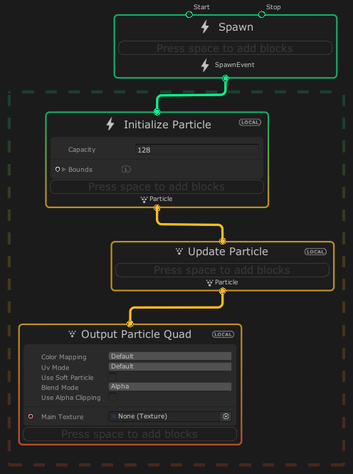
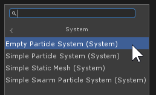

# 系统
System 是指定义视觉效果的独立部分的一个或多个 [Contexts](Contexts.md)。系统可以是粒子系统、粒子条带系统、网格或生成机器。在坐标图视图中，System 在其包含的 Context 周围绘制一个虚线框。

多个系统可以在 Visual Effect Graph 中相互交互：

* 一个 **Spawn** 系统可以在一个或多个粒子系统中 **spawn particles** 生成粒子。这是生成粒子的主要方法。

* **粒子系统**能使用CPU 事件在**其他粒子系统**中**spawn particles** 生成粒子。这种替代方法可以基于模拟事件（如粒子消亡）从其他粒子生成粒子。

* **Spawn**系统可以**启用和禁用**其他**Spawn**系统。这允许您使用管理其他 Spawn 系统的主 Spawn 系统来同步粒子发射。

## 从模板创建系统

Visual Effect Graph 附带预构建的 System 模板，您可以将其添加到图形中。要从模板创建 System：

1. 右键单击工作区的空白区域，然后选择 **Create Node**。
2. 在 菜单中，选择 **System**。
3. 从列表中选择一个模板。

## 系统模拟空间

某些系统使用模拟空间属性来定义用于模拟其内容的参考空间：

* **Local space** 系统在本地模拟包含 [Visual Effect 组件](VisualEffectComponent.md) 组件的游戏对象的效果。
* **World space** 系统独立于包含 [Visual Effect 组件](VisualEffectComponent.md) 的游戏对象来模拟效果。

无论系统的模拟空间如何，您都可以使用 [Spaceable Properties](Properties.md#spaceable-properties) 来访问 Local 或 World 的值。

### 设置系统模拟空间

System 在其包含的每个 Context 的右上角显示其模拟空间。这是系统的模拟**空间标识符**。如果 Context 不使用处理任何依赖于模拟空间的内容，则它不会显示模拟空间标识符。

要更改系统的模拟空间，请单击系统的模拟空间标识符以在兼容空间之间循环。

### 属性中的模拟空间标识符

某些 [Spaceable 属性](Properties.md) 显示较小版本的模拟空间标识符。这不会更改系统的模拟空间，而是允许您在不同于系统模拟空间的空间中表示值。例如，System 可以在世界空间中进行模拟，但 Property 可以是本地位置。

