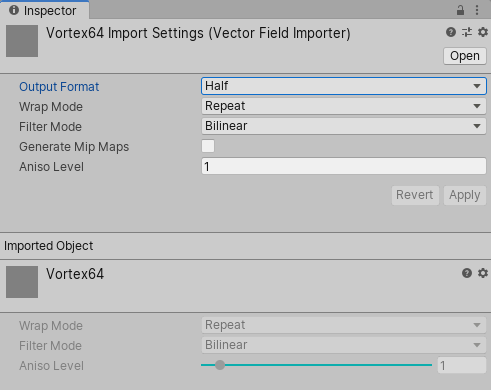

<b>实验性:</b> 此功能目前是试验性的，在以后的主要版本中可能会发生变化。要使用此功能，请在工程 Preferences 的 <b>Visual Effects</b> 选项卡中启用 <b>Experimental Operators/Blocks</b>。

# 向量场 / 有向距离场

向量场和有向距离场是包含存储在体素中的值的 3D 场。这些纹理在 Visual Effect Graph 中以 3D 纹理的形式提供，并且可以使用 Volume File（`.vf`）文件格式导入。

Volume File 是一个[开源规范](https://github.com/peeweek/VectorFieldFile/blob/master/README.md)，它包含用于存储浮点数据的基本结构。Unity 会自动导入体积文件，在 Unity 中自动作为 3D 纹理导入，并且可以在输入 3D 纹理的 Visual Effect Graph 块和运算符中使用，例如 Vector Field 或 Signed Distance Field 块。

## Vector Field Importer

Unity 在 Inspector 中提供以下设置来导入 Volume File 文件：

* **Output Format :** 输出 3D 纹理的精度
  * Half : 浮点，16 位半精度
  * Float : 具有 32 位单精度的浮点数
  * Byte : 具有 32 位单精度的浮点数
* **Wrap Mode :** 具有 32 位单精度的浮点数
* **Filter Mode :** 输出纹理的 Filter Mode
* **Generate Mip Maps :** 是否为纹理生成 mip 贴图
* **Aniso Level :** 各向异性级别

## 生成矢量字段文件

您可以通过以下方式之一生成向量场：

- 使用与[VFXToolbox](https://github.com/Unity-Technologies/VFXToolbox) 捆绑在一起的 Houdini VF 导出器（位于 /DCC~ 文件夹中）
- files that follow the specification.编写您自己的导出器以编写遵循规范的  [VF Files](https://github.com/peeweek/VectorFieldFile/blob/master/README.md)  文件。
