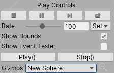
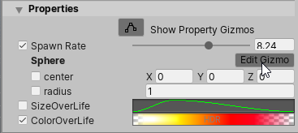

# Visual Effect (组件)

Visual Effect Component 基于 Visual Effect Graph 资源在场景中创建 Visual Effect 的实例。它控制效果的播放方式、渲染方式，并允许用户通过编辑 [Exposed Properties](PropertiesAndBlackboard.md#exposed-properties) 来自定义实例。

## 如何创建 Visual Effect

要创建 Visual Effect:

1. 使用 Inspector 中的 **Add Component** 菜单添加 Visual Effect 组件，或导航到 **Visual Effect > > Component**。
2. 单击 Asset Template 属性旁边的 **New** 按钮。
3. 保存新的 Visual Effect Graph 资源。

然后，Visual Effect Graph 窗口将打开新创建的资源。

要创建包含 Visual Effect 组件的完整游戏对象，请导航到 GameObject 菜单，单击 **Visual Effects**，然后选择 **Visual Effect**。

当您将 Visual Effect Graph 资源从项目视图拖动到 Scene 视图或层次结构视图时，它会自动创建一个具有 Visual Effect Component 的子游戏对象：

- 拖放到 Scene 视图中时：在摄像机前面的屏幕中央。
- 当拖放到 Hierarchy 中的 no Parent Game Object 下时：在世界的原点。
- 当拖放到 Hierarchy 中的 Parent Game Object 下时：在父对象的变换处。

## Visual Effect Inspector

Visual Effect Inspector可帮助您配置 Visual Effect 的每个实例。它仅显示与此特定实例相关的值。

| Item               | Description                                                  |
| ------------------ | ------------------------------------------------------------ |
| Asset Template     | 引用 Unity 用于此实例的 Visual Effect Graph 的 Object Field。  The **New/Edit** 按钮允许您创建新的 Visual Effect Graph 资源或编辑当前资源。单击 **New/Edit**时，Unity 会打开 Visual Effect Graph 资源，并将此场景实例连接到 Target Game Object 面板。 |
| Random Seed        | 一个 Integer Field ，显示用于此实例的当前随机种子。**Reseed**  按钮会为此组件生成一个新的随机种子。 |
| Reseed On Play     | 每次 Unity 将 Play Event 发送到 Visual Effect 时随机计算新种子的布尔设置。 |
| Initial Event Name | 允许 Unity 在启用时覆盖发送到组件的默认事件名称（字符串）。（默认: *OnPlay* ） |

#### 渲染属性

渲染属性控制视觉效果实例将如何渲染和接收照明。这些属性按实例存储在场景中，不会对 Visual Effect Graph 应用修改。

| 项目                  | 描述   |
|-----------------------|---------------------------------------------------------------------------------------------------------------------------------------------------------------------------------------------------------------------------------------------------------------------------------------------|
| Priority              | 控制效果的透明度顺序。仅当项目使用 High Definition Render Pipeline 时，才会显示此属性。 |
| Rendering Layer Mask  | 此属性的功能因项目使用的渲染管线而异。  &#8226; **High Definition Render Pipeline**: 如果在HDRP资产中配置了Lighting Layer Mask。  &#8226; **Universal Render Pipeline**: 确定此渲染器位于哪个渲染层上。 |
| Reflection Probes     | 指定场景中的反射如何影响渲染器。仅当项目使用 Universal Render Pipeline 时，才会显示此属性。 |
| Light Probes          | 控制 Use of Light 探针来计算效果的 Ambient Lighting。  |
| Anchor Override       | (Visible Only using Blend Probes option for Light Probes) :定义用于计算探针采样位置的替代变换。   |
| Proxy Volume Override | (Visible Only using Proxy Volume option for Light Probes) : 定义替代光照探针代理体积，以便计算探针采样。  |
| Sorting Layer         | 在其他[SpriteRenderer](https://docs.unity3d.com/ScriptReference/SpriteRenderer.html)组件中指定渲染器的组。 |
| Order in Layer        | 相对于其他 [SpriteRenderer](https://docs.unity3d.com/ScriptReference/SpriteRenderer.html) 组件，用分类层指定渲染器顺序。另请参见 [Renderer.sortingOrder](https://docs.unity3d.com/ScriptReference/Renderer-sortingOrder.html)。  |

#### 属性

属性类别显示在 Visual Effect Graph Blackboard 中定义为 **Exposed Property** 的任何属性。每个属性都可以从其默认值中覆盖，以便自定义场景中的 Visual Effect 实例。某些属性也可以直接在场景中使用 Gizmo 进行编辑。

| 项目                 | 描述                                                  |
| -------------------- | ------------------------------------------------------------ |
| Show Property Gizmos | 切换用于设置某些公开属性（球体、盒体、圆柱体、变换、位置）的编辑小工具的显示。您可以使用每个 Gizmo 属性旁边的专用按钮来访问每个 Gizmo。 |
| Properties           | Visual Effect Graph 资源中已公开的所有属性。您可以编辑此 Visual Effect 实例的这些属性。有关更多信息，请参阅 [公开属性](Blackboard.md#exposed-properties-in-inspector)。 |

要访问属性值，请使用 Inspector 编辑它们，使用 [C# API](https://docs.unity3d.com/2019.3/Documentation/ScriptReference/VFX.VisualEffect.html) 或使用属性绑定器。

## Play Controls 窗口

Play Controls （播放控件） 窗口显示 UI 元素，通过这些元素，您可以控制当前选定的 Visual Effect 实例。当选择 Visual Effect Game Object 时，它将显示在 Scene View 的右下角。

播放 Controls Window 显示以下控件：

* Stop (按钮) :重置效果并将其状态设置为暂停。
* Play / Pause (按钮) : 切换效果的暂停状态。
* Step (按钮) : 暂停效果并模拟一帧。
* Restart (按钮) : 取消暂停效果，重置效果，并发送默认的播放事件。
* Rate (Int 滑块) : 设置效果的播放速率（以百分比表示）。
* Set (弹出窗口) : 从菜单中设置效果的自定义播放速率。
* Show Bounds (勾选框) :切换效果边界的可见性。
* Show Event Tester (勾选框) : 显示 Event Tester 实用程序窗口。
* Play() and Stop() （按钮） : 将默认的 OnPlay 和 OnStop 事件发送到组件。
* (Optional) Gizmos (弹出窗口) : 切换属性小工具的可见性。

## 使用 Gizmo 编辑属性

您可以在场景中使用 Gizmo 编辑某些属性。要启用 Gizmo 编辑，请单击 Inspector 中的 **Show Property Gizmos** 按钮。启用属性 Gizmo 后，可以使用 Gizmos 编辑的每个属性都将在可以使用 Gizmos 编辑的每个属性旁边显示 **Edit Gizmo** 按钮。

