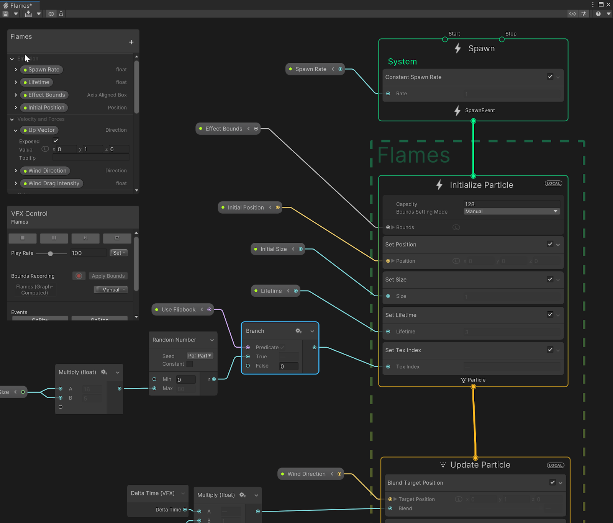
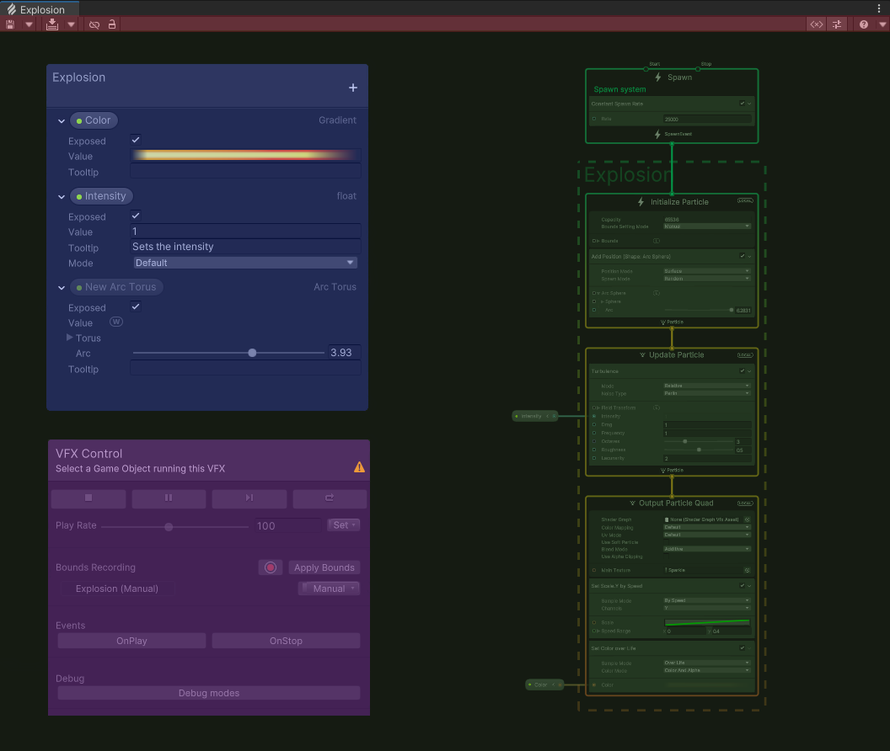
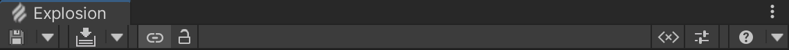
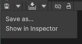
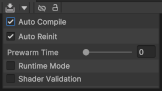
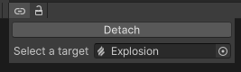
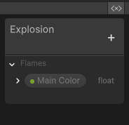
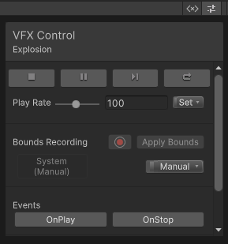
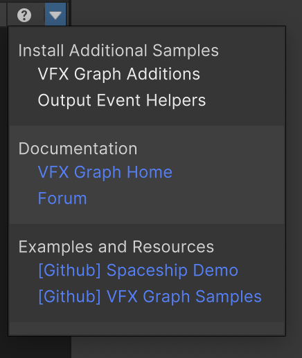
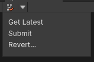

# Visual Effect Graph 窗口

Visual Effect Graph 窗口是 Visual Effect Graph 的主窗口。您可以在此处编辑 Visual Effect Graph 资源和 Subgraph 资源。该窗口显示一个工作区，其中包含[Visual Effect Graph 资源](VisualEffectGraphAsset.md) 包含的 Systems、Contexts 和 Operators。

## 打开 Visual Effect Graph 窗口

要打开 Visual Effect Graph 窗口，您可以使用以下任一方法：

* 在 Project 窗口中，双击 [Visual Effect Graph](VisualEffectGraphAsset.md) 资源或 [SubGraph](Subgraph.md) 资源。您还可以单击相应资源的 Inspector 窗口中的 **Open** 按钮。这会将您打开的资源连接到窗口。
*在 [Visual Effect 组件](VisualEffectComponent.md#the-visual-effect-inspector)的 Inspector 窗口中，单击 **Asset Template** 属性旁边的 **Edit** 按钮。这会将分配给 **Asset Template** 的 Asset 连接到窗口。
* 在菜单中，选择 **Window > Visual Effects > Visual Effect Graph**。这将打开一个空的 Visual Effect Graph 窗口，因此您需要打开 Visual Effect Graph 资源才能使用编辑器。

## Visual Effect Graph 窗口布局

在 Visual Effect Graph 窗口中，有多个区域和面板。

* **[Toolbar 工具栏](#Toolbar)** （红色）：此栏包含全局影响 Visual Effect Graph 的控件。这包括指定 Unity 何时编译 Visual Effect Graph 的控件，以及用于显示/隐藏某些面板的控件。
* **[Node Workspace 节点工作区](#NodeWorkspace)** (绿色) : 您可以在此处查看和编辑 Visual Effect Graph。
* **[Blackboard 面板](#Blackboard)** (蓝色) : 此面板显示 Visual Effect Graph 使用的属性。
* **[VFX Control](#TargetGameObject)** (紫色) : 此面板显示当前连接的游戏对象的控件。

### Toolbar 工具栏

Visual Effect Graph 窗口工具栏包含对 Visual Effect Graph 资源进行操作的功能。

| 项目                  | 描述                                                  |
| --------------------- | ------------------------------------------------------------ |
| **Save**                | **操作** : 使用此按钮可保存当前打开的 Visual Effect Graph 及其子图形。 **下拉列表**:  &#8226; **Save as…**: 将 Visual Effect Graph 保存在指定的名称和/或位置下。 &#8226; **Show in Inspector**: 将 Visual Effect Graph 的资产聚焦在 Inspector 中。|
| **Compile**                | **操作** : 重新编译打开的 Visual Effect Graph。 **下拉列表**:  &#8226; **Auto Compile**: 自动编译 Visual Effect Graph。 &#8226; **Auto Reinit**: 当 **Spawner** 或 **Init** 上下文中的值发生更改时，自动重新初始化附加的组件。 &#8226; **Prewarm Time**: 指定用于 **Auto Reinit** 的预热持续时间。如果 VFX 已经具有运行时预热，则会忽略此设置。 &#8226;**Runtime Mode**: 强制优化编译，即使编辑器处于打开状态。 &#8226; **Shader Debug Symbols**: 在 Unity 编译创作的 VFX 资源时强制生成着色器调试符号。 &#8226; **Shader Validation**: 在重新编译效果时强制进行着色器编译，即使没有可见的视觉效果也是如此。这将显示场景中的 Shader 错误。|
| **Auto Attach**                | **Toggle**: 切换 Auto Attachment 面板的可见性。通过 **Auto Attachment** 面板，您可以通过在 Hierarchy 中选择打开的 Visual Effect Graph 来将其附加到游戏对象。将视觉效果附加到游戏对象后，它将启用 VFX Control 面板中的 Visual Effect 控件，并允许您在 Scene 视图中调整小工具。|
| **Lock**           | **Toggle**: 切换自动附件的锁定/解锁。如果将切换开关设置为 unlocked，则可以通过选择 Hierarchy 中的项将打开的 Visual Effect Graph 附加到游戏对象。如果将切换开关设置为 locked - 当前连接的游戏对象将变为锁定状态，并禁用自动连接。然后，无法通过选择 Hierarchy 中的项来附加 Visual Effect Graph。您可以在 Auto Attach 面板的对象选取器中手动保持锁定并更改附件。|
| **Blackboard**                | **Toggle**: 切换 **Blackboard 面板**的可见性。|
| **VFX Control**                | **Toggle**: Toggles the visibility of the VFX Control.|
| **Help**                | **Toggle**: 打开 Visual Effect Graph [手册](https://docs.unity.cn/cn/Packages-cn/com.unity.visualeffectgraph@latest/).  **下拉列表**:  **VFX Graph Additions**: 安装使用 Visual Effect Graph 制作的预制视觉效果和实用程序操作符。其中包括 Bonfire、Lightning、Smoke 和 Sparks 效果示例。还有各种运算符和子图块：  &#8226; **Get Strip Progress**: 计算 0 到 1 范围内条带中粒子进度的子图。您可以使用它来对曲线和渐变进行采样，以根据条带的进度修改条带。  &#8226; **Encompass (Point)**:一个子图，它扩大 AABox 的边界以包含一个点。  &#8226; **Degrees to Radians and Radians to Degrees**: 可帮助您在图表中转换弧度和度数的子图。  **Output Event Helpers**: 此版本的 Visual Effect Graph 在 OutputEvent 帮助程序示例中引入了新的帮助程序脚本，以帮助您设置 OutputEvents：  &#8226; **Cinemachine Camera Shake**:一个输出事件处理程序脚本，可通过 [Cinemachine Impulse Source](https://docs.unity3d.com/Packages/com.unity.cinemachine@latest/index.html?subfolder=/manual/CinemachineImpulseSourceOverview.html), ，在给定的输出事件上。  &#8226; **Play audio**: 一个 Output Event Handler 脚本，用于在给定输出事件上播放单个 AudioSource。  &#8226; **Spawn a Prefab**:  一个输出事件处理程序脚本，用于在给定输出事件上生成预制件 （从池中管理）。它使用 position、angle、scale 和 lifetime 来定位预制件，并在延迟后将其禁用。要同步其他值，您可以在 Prefab 中使用其他脚本：  &#8226; **Change Prefab Light**: 演示如何将光源与效果同步的示例。  &#8226; **Change Prefab RigidBody Velocity**:演示如何将 RigidBody 速度的更改与效果同步的示例。  &#8226; **RigidBody**: 一个输出事件处理程序脚本，用于对给定输出事件上的RigidBody 更改力或速度。   &#8226; **Unity Event**: 在给定输出事件上引发 UnityEvent 的输出事件处理程序。  &#8226; **[VFX Graph Home](https://unity.com/visual-effect-graph)**: 打开 Visual Effect Graph 主页。  &#8226; **[Forum](https://forum.unity.com/forums/visual-effect-graph.428/)**: 打开 Visual Effect Graph 子论坛。  &#8226; **[Github] [Spaceship Demo](https://github.com/Unity-Technologies/SpaceshipDemo)**: 打开 AAA 级可播放广告第一人称演示存储库，其中展示了使用 Visual Effect Graph 制作并使用高清渲染管道渲染的效果。  &#8226; **[Github] [VFX Graph Samples](https://github.com/Unity-Technologies/VisualEffectGraph-Samples)**: 打开一个存储库，其中包含使用 Visual Effect Graph 制作的示例场景和视觉效果。|
| **Version Control**                | **操作**: 启用 [Version Control](https://docs.unity3d.com/Manual/Versioncontrolintegration.html)，则这些按钮将变为可用。单击 main 按钮可查看您在资源文件中所做的更改。  **下拉列表**:  &#8226; **Get Latest**: 使用存储库中的最新更改更新资源文件。 &#8226; **Submit**: 将资源的当前状态提交到版本控制系统。 &#8226; **Revert**: 放弃您对资源所做的更改。|

### Node Workspace 节点工作区

Node workspace （节点工作区） 是工具栏下方的区域。您可以在此处导航和编辑图表。Node 工作区还包含 **Blackboard** 和 **Target VisualEffect** GameObject 面板。

### Blackboard 面板

**Blackboard** 是一个面板，允许您管理 Visual Effect Graph 使用的属性。它是一个浮动面板，独立于当前 Workspace 视图的缩放和位置。窗口始终将此面板显示在 **Node Workworks** 中的 Nodes 之上。

要调整此面板的大小，请单击任何边缘或角落并拖动。要重新定位此面板，请单击面板的标题并拖动。

有关更多信息，请参阅  [Blackboard](Blackboard.md)。

### VFX Control

VFX Control （VFX 控制面板） 显示它当前附加到的游戏对象的控件。它使您能够：

* 控制播放选项
* 触发事件
* 使用 Debug 模式
* 记录视觉效果的边界。有关边界录制的更多信息，请参阅 [记录视觉效果的边界。有关边界录制的更多信息，请参](visual-effect-bounds.md)。

它是一个浮动面板，独立于当前 Workspace 视图的缩放和位置。窗口始终将此面板显示在 **Node Workworks** 中的 Nodes 之上。

要调整此面板的大小，请单击任何边缘或角落并拖动。要重新定位此面板，请单击面板的标题并拖动。

## 使用 Node Workspace 节点工作区

### 工作区导航

Node Workspace 的导航控件类似于其他基于图形的 Unity 功能使用的导航控件：

#### 在 graph 中移动：

* 中键单击并拖动。
* 按住 **Alt** 键，单击并拖动。

#### 使用以下方式进行放大和缩小：

* 放大，请向上滚动鼠标滚轮。
* 缩小，请向下滚动鼠标滚轮。

#### 选择元素：

* 要单独选择元素，请单击它们。
  * 要在当前选择中添加或删除元素，请按住 **Ctrl** 键并单击它。
* 要创建选择矩形，请在空白区域单击并拖动。这将选择矩形接触的每个元素。
  * 您可以使用选择矩形在当前选择中添加/删除元素。为此，请按住 **Ctrl** 键并使用上述方法创建新的选择矩形。
* 要创建选区选框，请按住 **Shift** 键，在空白处单击，然后拖动以创建路径。这将选择路径/选框接触的每个元素。
* 要清除当前选择，请单击空白区域。

#### 重点

*  要专注于特定节点/节点组，请选择 节点 并按 **F** 键。
*  要关注整个图表，请清除当前选择并按 **F** 键。

#### 复制, 剪切, 粘贴, 复制元素:

* 右键单击一个元素或一组元素，以打开显示相关命令的菜单。
* 键盘快捷键：
  * **copy复制**: Ctrl+C.
  * **剪切**: Ctrl+X.
  * **粘贴**: Ctrl+V.
  * **Duplicate复制**: Ctrl+D.
  * **Duplicate with edges**: Ctrl+Alt+D.

### 添加 graph 元素

要添加图形元素，您可以使用以下任一方法：

* **右键单击菜单** ：右键单击以打开菜单，选择 **添加节点**，然后从菜单中选择要添加的**节点**。此操作与上下文相关，基于光标下方的元素，并且仅为您提供兼容的图形元素。
* **空格键菜单** ：此快捷方式相当于右键单击，然后选择 **Add Node** 添加节点。
* 交互式连接 ：从端口（属性或工作流）创建边缘时，拖动边缘并释放单击到空白区域以显示节点菜单。此操作与上下文相关，具体取决于源端口的类型，并且仅为您提供可以连接到的兼容图形元素。

### 操作 graph 元素

您可以在工作区中操作图形元素 ：

#### 移动元素

* 要在工作区中移动元素，请左键单击元素的标题，将元素拖动到新位置，然后释放鼠标按钮。
* 要在 Context 中移动 [Blocks](Blocks.md) 或将其移动到另一个 Context，请单击 Block 的标题，将 Block 拖动到新位置，然后松开鼠标按钮。

#### 调整元素大小

某些元素（如 Sticky Notes）支持调整大小。为此，请单击任何边缘或角落，拖动直到达到所需的元素大小，然后松开鼠标按钮。
