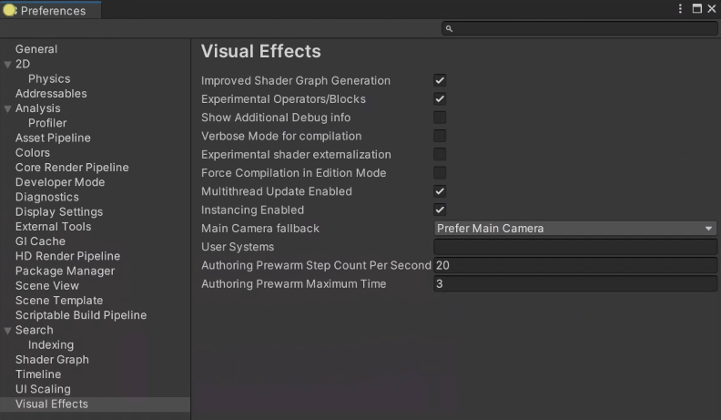

# Visual Effect Graph 首选项

Visual Effect Graph preferences 是 Unity Preferences 窗口中的一个面板。要访问此面板，请转到 **Edit > Preferences > Visual Effects**。

## 属性

| 名称                                         | 描述                                                  |
| -------------------------------------------- | ------------------------------------------------------------ |
| **Experimental Operators/Blocks**            | 在 [Node Creation 菜单](GettingStarted.md#manipulating-graph-elements) |
| **Show Additional Debug info**               | 选择 [Blocks](Blocks.md), [Operators](Operators.md) 或 [Contexts](Contexts.md) |
| **Verbose Mode for Compilation**             | 当 Unity 编译 VFX 图形时，在控制台中启用详细日志记录。    |
| **Experimental Shader Externalization**      | 在 [Visual Effect Graph Asset Inspector](VisualEffectGraphAsset.md)中启用外部化着色器以进行调试目的。 |
| **Generate Shaders with Debug Symbols**      | 当Unity编译VFX图时，启用着色器调试符号。 |
| **Force Compilation in Edition Mode**        | 在保存资产时禁用图形优化（仅出于调试目的） |
| **Main Camera fallback**                     | 指定[MainCamera](Operator-MainCamera.md)运算符的相机源，并在编辑器中使用[Blocks](Blocks.md)。选项是： &#8226; **Prefer Main Camera**: 如果 Game 视图处于打开状态，Unity 将使用主摄像头。如果 Game 视图未打开，但 Scene 视图打开，则 Unity 将使用 Scene 视图摄像机。 &#8226; **Prefer Scene Camera**: 如果 Scene 视图处于打开状态，则 Unity 将使用 Scene 视图摄像机。如果 Scene 视图未打开，但 Game 视图打开，则 Unity 使用主摄像机。 &#8226; **No Fallback**: 使用主摄像机，即使 Unity 未向主摄像机渲染。 |
| **User Systems**                             | 指定存储 VFX Graph 资产的目录的路径，以用作新效果的模板。此文件夹中的任何 VFX Graph 资源都会显示在 **System** 下的 Visual Effect Graph 视图上下文菜单中。 |
| **Authoring Prewarm Step Count Per Second**  | 指定每秒的步数[自动重新初始化](VisualEffectGraphWindow.md#Toolbar) 预热。在创作 VFX 图表时，较高的值可能会影响性能。 |
| **Authoring Prewarm Maximum Time**           | 指定[自动重新初始化](VisualEffectGraphWindow.md#Toolbar) 可以预热。 |
