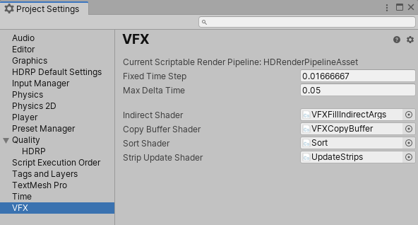

# Visual Effect 项目设置

Visual Effect Graph Project Settings 是 Unity Project Settings 窗口中的一个部分。您可以在 **VFX > Edit > Project Settings** 中访问这些设置。

## 属性:

| **名称**                               | **描述**                                                  |
| ---------------------------------- | ------------------------------------------------------------ |
| Current Scriptable Render Pipeline | 显示为 VFX Graph Shader Compilation 检测到的当前使用的渲染管线资源。 |
| Fixed Time Step                    | 	Fixed Delay Before Simulation （固定模拟前延迟） 对于在 **Fixed Delta Time Simulation** 中配置的效果的步骤 |
| Max Delta Time                     | 模拟允许的最大固定时间步长。              |
| Indirect Shader                    | （自动设置）用于间接调用的主计算着色器 |
| Copy Buffer Shader                 | （自动设置）用于 Compute Buffer Copy 的 Compute Shader |
| Sort Shader                        | （自动设置）计算用于粒子排序的着色器 |
| Strip Update Shader                | （自动设置）用于粒子条带更新的计算着色器 |

> **Note:** 修复的Delta Time在异步更新中起作用，使用 `deltaTime = N * FixedTimeStep` (带有 `deltaTime = min(deltaTime , MaxDeltaTime)`).
>
> N 由当前帧速率决定。
>
> 在此模式下，deltaTime 在某些帧上可以等于 0。
