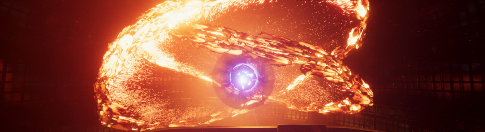

# Visual Effect Graph

Visual Effect Graph 使您能够使用基于节点的视觉逻辑来创作视觉效果。你可以用它来做简单的效果，也可以做非常复杂的模拟。Unity将Visual Effect Graphs存储在Visual Effect Graph Asset中，你可以在 [Visual Effect组件](VisualEffectComponent.md) 中使用它。你可以在场景中多次使用Visual Effect Graph Asset。

## 使用Visual Effect Graph
使用Visual Effect Graph可以:

+ 创建一个或多个粒子系统。
+ 添加静态网眼和控制着色器属性。
+ 创建属性以自定义您在场景中使用的实例。
+ 创建事件以打开和关闭效果的一部分。 然后，您可以通过 C＃或[时间轴](https://docs.unity3d.com/Packages/com.unity.timeline@latest/index.html)从场景发送这些事件。
+ 通过创建通常使用的节点的子图表来扩展功能库。
+ 在另一个Visual Effect Graph中使用Visual Effect Graph。例如，您可以在更复杂的图表中重复使用并自定义简单但可配置的爆炸。
+ 立即预览更改，因此您可以以各种速率模拟效果并进行逐步模拟。有关如何安装Visual Effect Graph的说明，请参阅[Visual Effect Graph入门](GettingStarted.md).
